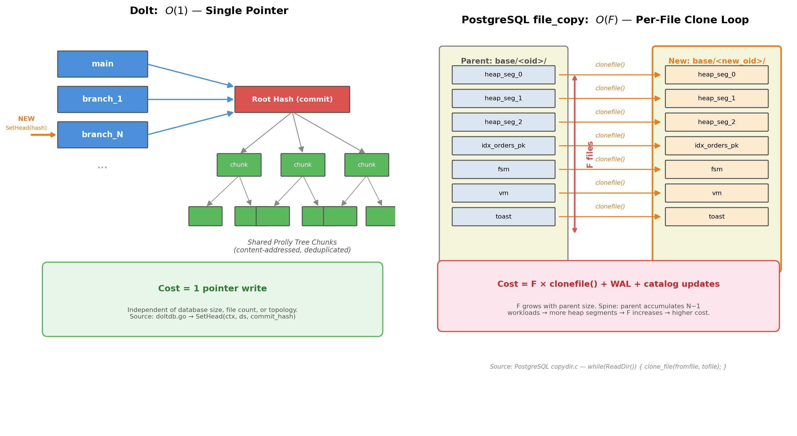

# Experiment 1: Branch Creation Storage Overhead

**Date**: 2026-02-09 (Dolt, file_copy), 2026-02-11 (Neon)

## 1. Research Questions & Conclusions

**RQ1: Does branch topology affect marginal storage cost?**

| Backend | Topology-sensitive? | Conclusion |
|---------|-------------------|------------|
| **Dolt** | No | Near-zero cost (~685 B/branch) for all topologies. Branch = pointer write in content-addressed DAG. |
| **file_copy** | **Yes** | Spine grows superlinearly (152 KB → 2.74 MB at N=1024). Fan-out/bushy stay flat (~165 KB). |
| **Neon** | No | Constant ~7.3 MB/branch (logical measurement, not physical). |

- **file_copy spine volatility unexplained**: At high N, spine topology
  produces extreme variance (CV > 1.5) with negative deltas (storage
  *decreasing* during branch creation). We observe the pattern but do not
  have a definitive root cause — likely involves APFS internal extent
  tracking, background compaction, or block ownership reassignment in deep
  clone chains, but this has not been confirmed.


**RQ2: Why does file_copy diverge by topology?**

PostgreSQL's `CREATE DATABASE ... STRATEGY = FILE_COPY` runs a **per-file loop**
over the parent directory (`copydir.c: while(ReadDir()) { clone_file(); }`).
In spine topology, the parent accumulates data from all prior branches → more
files (F) → more `clonefile()` calls → cost grows as O(F). In fan-out, the
parent is always the constant-size root → cost stays constant.


## 2. Methodology

| Parameter | Value |
|-----------|-------|
| Backends | Dolt, file_copy (PostgreSQL CoW), Neon |
| Topologies | spine (linear chain), bushy (random parent), fan_out (all from root) |
| Branch counts (N) | 1–1024 (Dolt, file_copy); 1–8 (Neon, platform limit) |
| Repetitions | 3 per config |
| Workload per branch | 100 INSERTs + 20 UPDATEs + 10 DELETEs (TPC-C orders) |
| Metric | `storage_delta = disk_size_after - disk_size_before` per branch creation |
| Data | 78 parquet files, 36,981 rows |

### Storage Measurement

| Backend | Method | Type | CoW-aware? |
|---------|--------|------|------------|
| **Dolt** | `st_blocks * 512` on shared data directory | Physical | Yes |
| **file_copy** | `shutil.disk_usage()` on isolated APFS volume | Physical | Yes |
| **Neon** | `pg_database_size()` per branch, summed | Logical | No |

<details>
<summary>Measurement details per backend</summary>

**Dolt** stores all branches in a single content-addressed chunk store. Measuring
the data directory with `st_blocks * 512` gives true physical storage because
identical chunks across branches are stored exactly once. This is the
[recommended approach](https://github.com/dolthub/dolt/issues/6624) from the
Dolt team.

**file_copy** creates each branch as a separate PostgreSQL database using
`CREATE DATABASE ... STRATEGY = FILE_COPY` with `file_copy_method = 'clone'`
(PostgreSQL 18+). On macOS, this calls APFS `clonefile()` to create
copy-on-write clones of the parent's data files — the raw file duplication
cost is near-zero. We measure total storage via `shutil.disk_usage()` on a
dedicated APFS volume that contains only the PostgreSQL data directory. Volume
isolation ensures the measurement captures only PostgreSQL activity and
correctly reflects CoW block sharing.

**Neon** measures storage via `pg_database_size()`, which reports the **logical**
size of each branch's database. This does **not** reflect copy-on-write page
sharing between branches. As Neon's own documentation states:

> "If you have a database with 1 GB logical size and you create a branch of it,
> both branches will have 1 GB logical size, even though the branch is
> copy-on-write and won't consume any extra physical disk space until you make
> changes to it."
> — [Neon Glossary](https://github.com/neondatabase/neon/blob/main/docs/glossary.md)

The only CoW-aware alternative (`synthetic_storage_size`) updates every 15–60
minutes and is project-level only, making it unsuitable for per-branch
measurement.

</details>

## 3. Results

### Marginal Storage Delta by Backend

**Dolt** (physical, content-addressed):

| N | Spine | Bushy | Fan-out |
|---|-------|-------|---------|
| 1 | 2.67 KB | 1.33 KB | 0 B |
| 64 | 5.67 KB | 5.35 KB | 5.42 KB |
| 1024 | 685 B | 343 B | 11.33 KB |

**file_copy** (physical, filesystem CoW):

| N | Spine | Bushy | Fan-out |
|---|-------|-------|---------|
| 1 | 152.00 KB | 154.67 KB | 86.67 KB |
| 64 | 190.17 KB | 145.54 KB | 122.12 KB |
| 256 | 167.42 KB | 162.17 KB | 120.44 KB |
| 512 | 623.78 KB | 181.08 KB | 137.12 KB |
| 1024 | **2.74 MB** | 212.14 KB | 165.02 KB |

**Neon** (logical, `pg_database_size()`):

| N | Spine | Bushy | Fan-out |
|---|-------|-------|---------|
| 1 | 7.29 MB | 7.29 MB | 7.29 MB |
| 4 | 7.32 MB | 7.30 MB | 7.29 MB |
| 8 | 7.35 MB | 7.31 MB | 7.29 MB |

At N=1024, file_copy spine is **17x** fan-out and **13x** bushy.


*Figure 1: Per-branch storage delta trajectory at per-backend max N (Dolt and
file_copy at N=1024, Neon at N=8).*

## 4. Analysis

### 4.1 Dolt O(1) vs file_copy O(F): The Branching Mechanism Gap


*Figure 2: Dolt creates a branch with a single pointer write O(1). PostgreSQL
file_copy calls `clonefile()` per file in the parent directory — O(F).*

**Dolt — O(1): single pointer write.** Creating a branch calls
[`SetHead(ctx, ds, commit_hash)`](https://github.com/dolthub/dolt/blob/main/go/libraries/doltcore/doltdb/doltdb.go)
— one pointer to an existing commit in the content-addressed Prolly tree.
No data copied, no files iterated, cost independent of database size or topology.

> "When you create a new branch, you create a new pointer, a small amount of
> metadata. [...] There is no additional object storage required unless a
> change is made on a branch."
> — [How Dolt Scales to Millions of Versions](https://www.dolthub.com/blog/2025-05-16-millions-of-versions/)

**file_copy — O(F): per-file clone loop.** PostgreSQL's
[`copydir.c`](https://www.postgresql.org/message-id/E1u25N2-003GyZ-1O@gemulon.postgresql.org)
iterates over the parent's data directory:

```c
while ((xlde = ReadDir(xldir, fromdir)) != NULL) {
    if (file_copy_method == FILE_COPY_METHOD_CLONE)
        clone_file(fromfile, tofile);   /* one clonefile() per file */
    else
        copy_file(fromfile, tofile);
}
```

Each `clonefile()` is individually cheap (CoW), but the **count equals F**
(heap segments, indexes, FSM, VM, TOAST files in the parent directory).
Additionally, `CREATE DATABASE` issues two forced checkpoints (flushing all
dirty buffers server-wide), WAL records, and catalog updates.

### 4.2 Why file_copy Spine Grows Superlinearly

The O(F) cost is topology-sensitive because **F depends on parent size**:

- **Spine**: parent = branch_{i-1}, which accumulated all prior workloads.
  More rows → more heap segments, larger indexes → F grows with i.
  Each successive `CREATE DATABASE` clones more files with more checkpoint
  overhead. Cost grows linearly per branch → **total grows as O(N²)**.
  Result: 152 KB at N=1 → 2.74 MB at N=1024.

- **Fan-out**: parent = root (constant size, constant F). Cost ≈ 120–165 KB.

- **Bushy**: random parent, average depth O(log N). Modest growth: 155–212 KB.

### 4.3 Deep Clone Chains Cause Volatile Storage Deltas

Spine also produces **highly volatile** per-branch deltas:


*Figure 3: Individual storage deltas (scatter) with rolling mean and ±1 std
band for file_copy at N=1024.*

- **Spine**: CV > 1.5 past branch ~1000. Individual deltas range from -1.3 MB
  to +77 MB. Deep APFS clone chains (depth = N) make extent tracking
  non-deterministic — deferred block resolution and background compaction
  cause negative deltas (space reclamation) alongside extreme positives.
- **Bushy**: tight (CV < 0.1), clone depth O(log N) stays in APFS's stable range.
- **Fan-out**: tightest (CV ≈ 0.02), always depth 1.

### 4.4 Why Neon Shows Constant ~7.3 MB

`pg_database_size()` reports logical size. Each branch receives an identical
workload → identical logical growth → topology has no effect. Under the hood,
Neon implements CoW at the page level, but this sharing is invisible to
`pg_database_size()`. The true physical cost is likely near-zero but not
measurable with available APIs.

> "A branch is a copy-on-write clone of your data."
> — [Neon Branching Docs](https://neon.tech/docs/conceptual-guides/branching)

### 4.5 Cross-Backend Summary

| Property | Dolt | file_copy | Neon |
|----------|------|-----------|------|
| Measurement type | Physical | Physical | Logical |
| Topology-sensitive? | No | **Yes** (spine 17x fan-out) | No |
| Cost at max N | ~685 B | 165 KB–2.74 MB | ~7.3 MB |
| Branch mechanism | Pointer in commit graph | Per-file directory copy | API-managed timeline |

### 4.6 Limitations

- **Neon**: capped at 8 branches; `pg_database_size()` = logical only
- **macOS only**: APFS behavior may differ from Linux ext4/XFS
- **Single workload**: TPC-C orders only; different workloads may shift thresholds
- **No Dolt GC**: unreferenced chunks may inflate Dolt measurements
