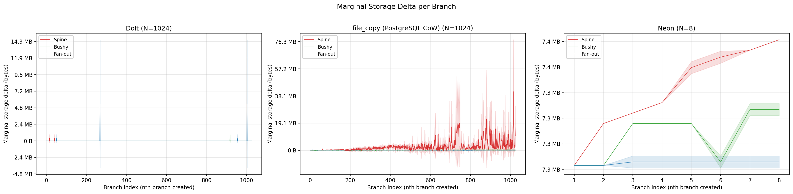
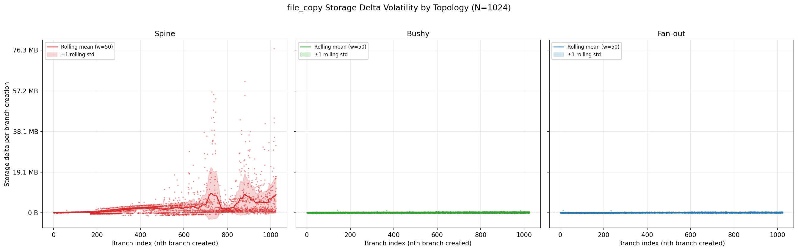

# Experiment 1: Branch Creation Storage Overhead

**Date**: 2026-02-09 (Dolt, file_copy), 2026-02-11 (Neon), 2026-02-25~26 (Xata)

## 0. Summary

| Property            | Dolt                    | file_copy                   | Neon                 | Xata                                  |
| ------------------- | ----------------------- | --------------------------- | -------------------- | ------------------------------------- |
| Measurement type    | Physical                | Physical                    | Logical              | Logical (metrics API)                 |
| Topology-sensitive? | No                      | **Yes** (spine 17x fan-out) | No                   | No at N=8 (sparse data at N≤4)       |
| Cost at max N       | ~685 B                  | 165 KB–2.74 MB             | ~7.3 MB              | 14.2–16.0 MB at N=16 (spine missing) |
| Branch mechanism    | Pointer in commit graph | Per-file CoW clone          | API-managed timeline | API-managed branching                 |

## 1. Experiment Procedure

One repetition (one full run) for a given backend, N, and topology:

1. Create fresh database from scratch
2. Add data to root branch (100 INSERTs + 20 UPDATEs + 10 DELETEs on TPC-C orders table)
3. For i = 1 to N:
   - Measure total storage → `disk_size_before`
   - Create branch_i from parent (depends on topology)
   - Measure total storage → `disk_size_after`
   - Record `latency`, `disk_size_before`, `disk_size_after` → one parquet row
   - Add data to branch_i (100 INSERTs + 20 UPDATEs + 10 DELETEs, not timed)

Each configuration (backend × topology × N) was run **3 repetitions** (Dolt, file_copy, Neon) or **2–6 repetitions** (Xata, variable due to retry/resume appending). Each repetition starts from a completely fresh database. All repetitions are appended to the same parquet file.

### Configurations


| Parameter         | Value                                                               |
| ----------------- | ------------------------------------------------------------------- |
| Backends          | Dolt, file_copy (PostgreSQL CoW), Neon, Xata                        |
| Branch counts (N) | 1–1024 (Dolt, file_copy); 1–8 (Neon); 1–16 (Xata, spine up to 8) |
| Data              | 92 setup parquet files, 37,245 setup rows                           |

### Storage Measurement


| Backend       | Method                                                     | Type                 | CoW-aware? |
| ------------- | ---------------------------------------------------------- | -------------------- | ---------- |
| **Dolt**      | `st_blocks * 512` on shared data directory                 | Physical             | Yes        |
| **file_copy** | `shutil.disk_usage()` on isolated APFS volume              | Physical             | Yes        |
| **Neon**      | `pg_database_size()` per branch, summed                    | Logical              | No         |
| **Xata**      | Branch Metrics API (`metric=disk`, max over 5 min), summed | Logical per instance | No         |

## 2. Metrics

**Marginal storage delta** is the change in total observed storage caused by creating one additional branch:

```
storage_delta = disk_size_after - disk_size_before
```

where `disk_size` is measured immediately before and after each branch creation call. Values reported in tables below are means across repetitions at each N.

## 3. Research Questions

### 3.1 RQ-to-Evidence Mapping

| RQ | Primary evidence | Role |
| -- | ---------------- | ---- |
| **RQ1**: Does the marginal storage cost of the nth branch differ across topologies for the same backend? | Table 4.1 + Figure 1 | Primary answer |
| **RQ2**: Do any backends exhibit constant marginal cost regardless of topology? | Table 4.1 + Figure 1 | Primary answer (qualitative) |
| **RQ3**: Does fan-out (shallow, wide) produce lower or higher overhead than spine (deep, narrow)? | Table 4.1 ratios at comparable N + Figure 1 | Primary answer |
| file_copy volatility context | Figure 2 | Supporting diagnostic (not standalone RQ evidence) |

### 3.2 RQ1 — Topology difference within backend

**RQ1: Does the marginal storage cost of the nth branch differ across topologies for the same backend?**

| Backend | Comparison point used | Observation | Answer |
| ------- | --------------------- | ----------- | ------ |
| **Dolt** | N=1024 | Spine 685 B, bushy 343 B, fan-out 11.33 KB | Minimal topology effect in absolute terms (near-zero baseline). |
| **file_copy** | N=1024 | Spine 2.74 MB, bushy 212 KB, fan-out 165 KB | **Yes**: strong topology sensitivity. |
| **Neon** | N=8 | Spine 7.35 MB, bushy 7.31 MB, fan-out 7.29 MB | No meaningful topology separation in this range. |
| **Xata** | **Common comparable N=8** | Spine 25.06 MB, bushy 24.89 MB, fan-out 22.64 MB | Similar at comparable N. Caveat: N=16 lacks spine coverage. |

### 3.3 RQ2 — Constant marginal cost across topology

**RQ2: Do any backends exhibit constant marginal cost regardless of topology?**

| Backend | Evidence at comparable N | Qualitative constancy judgment |
| ------- | ------------------------ | ------------------------------ |
| **Dolt** | N=1024: 343 B–11.33 KB across topologies | Approximately constant near zero (all topologies remain tiny). |
| **file_copy** | N=1024: 165 KB–2.74 MB across topologies | Not constant; spine diverges strongly from bushy/fan-out. |
| **Neon** | N=8: 7.29–7.35 MB across topologies | Approximately constant across topologies (logical metric). |
| **Xata** | **Common comparable N=8**: 22.64–25.06 MB | Roughly constant at comparable N; noisy and partially covered at N=16. |

### 3.4 RQ3 — Fan-out vs spine directionality

**RQ3: Does fan-out (shallow, wide) produce lower or higher overhead than spine (deep, narrow)?**

| Backend | Comparison N | Spine/Fan-out ratio | Direction |
| ------- | ------------ | ------------------- | --------- |
| **Dolt** | N=1024 | 0.06x | Spine is lower than fan-out at this point. |
| **file_copy** | N=1024 | 17.00x | Spine is much higher than fan-out. |
| **Neon** | N=8 | 1.01x | Spine is slightly higher than fan-out. |
| **Xata** | **Common comparable N=8** | 1.11x | Spine is higher than fan-out at N=8; N=16 lacks spine. |

Dolt is near-zero for both topologies; the 0.06x mean ratio is an outlier artifact in a quantized sparse-signal regime.
Therefore, we cannot conclude that for Dolt, Spine is cheaper than Fan-out.

## 4. Results

### 4.1 Marginal Storage Delta Tables

**Dolt** (physical, content-addressed):


| N    | Spine    | Bushy   | Fan-out  |
| ---- | -------- | ------- | -------- |
| 1    | 0 B      | 1.33 KB | 0 B      |
| 2    | 1.33 KB  | 1.33 KB | 683 B    |
| 4    | 0 B      | 1.00 KB | 0 B      |
| 8    | 171 B    | 341 B   | 683 B    |
| 16   | 85 B     | 1.42 KB | 0 B      |
| 32   | 10.71 KB | 128 B   | 10.71 KB |
| 64   | 5.67 KB  | 5.35 KB | 5.42 KB  |
| 128  | 42.83 KB | 21 B    | 45.34 KB |
| 256  | 4.00 KB  | 5 B     | 1.51 KB  |
| 512  | 11.33 KB | 683 B   | 22.00 KB |
| 1024 | 685 B    | 343 B   | 11.33 KB |

**file_copy** (physical, filesystem CoW):


| N    | Spine       | Bushy     | Fan-out   |
| ---- | ----------- | --------- | --------- |
| 1    | 152.00 KB   | 154.67 KB | 86.67 KB  |
| 2    | 152.00 KB   | 136.67 KB | 143.33 KB |
| 4    | 141.33 KB   | 128.33 KB | 126.00 KB |
| 8    | 171.17 KB   | 155.83 KB | 147.00 KB |
| 16   | 154.42 KB   | 157.92 KB | 130.25 KB |
| 32   | 157.33 KB   | 148.62 KB | 124.21 KB |
| 64   | 190.17 KB   | 145.54 KB | 122.12 KB |
| 128  | 264.98 KB   | 157.78 KB | 120.79 KB |
| 256  | 167.42 KB   | 162.17 KB | 120.44 KB |
| 512  | 623.78 KB   | 181.08 KB | 137.12 KB |
| 1024 | **2.74 MB** | 212.14 KB | 165.02 KB |

**Neon** (logical, `pg_database_size()`):


| N | Spine   | Bushy   | Fan-out |
| - | ------- | ------- | ------- |
| 1 | 7.29 MB | 7.29 MB | 7.29 MB |
| 2 | 7.30 MB | 7.29 MB | 7.29 MB |
| 4 | 7.32 MB | 7.30 MB | 7.29 MB |
| 8 | 7.35 MB | 7.31 MB | 7.29 MB |

**Xata** (logical, branch metrics API):


| N  | Spine    | Bushy    | Fan-out  |
| -- | -------- | -------- | -------- |
| 2  | 10.44 MB | 23.52 MB | 32.00 KB |
| 4  | 25.91 MB | 27.02 MB | 39.23 MB |
| 8  | 25.06 MB | 24.89 MB | 22.64 MB |
| 16 | —       | 15.95 MB | 14.20 MB |

At N=1024, file_copy spine is **17x** fan-out and **13x** bushy.

### 4.2 Per-Branch Delta Trajectory (Figure 1)


*Figure 1: Per-branch storage delta trajectory with one panel per backend
(Dolt/file_copy at N=1024, Neon at N=8, Xata at N=8 where all three topologies
are present). Each line is the mean across repetitions at each branch index;
shaded band = ±1 std.*

Figure 1 has one panel per backend. The y-axis is storage delta and the x-axis is branch index. Lines represent spine, bushy, and fan-out where data exists for that panel.

- **Dolt**: all three topologies cluster near zero across the full 1024-branch range. No visible separation between topologies.
- **file_copy**: bushy and fan-out stay flat near 120–165 KB. Spine diverges upward with large spikes, particularly in the second half of the range.
- **Neon**: all three lines overlap at ~7.3 MB with negligible separation.
- **Xata**: noisy with wide std bands; no clear topology separation at available N values.

### 4.3 file_copy Delta Volatility (Figure 2)


*Figure 2: Individual storage deltas for file_copy at N=1024. Each branch
index has 3 data points (one per repetition), shown as scatter dots. The
solid line is a rolling mean (window=50), and the shaded band is ±1 rolling
standard deviation. All three repetitions are overlaid on the same axes.*

Figure 2 zooms into file_copy at N=1024, with one panel per topology. Unlike Figure 1 which shows means, this figure plots every individual measurement as a scatter dot to reveal per-branch variance.
It supports the RQ1/RQ3 interpretation for file_copy by showing how spine variance and spikes differ from bushy/fan-out.

- **Spine**: scatter spans -1.3 MB to +77 MB. The rolling mean trends upward but individual points are extremely spread. Negative deltas (storage decreasing after branch creation) appear throughout.
- **Bushy**: scatter is tightly clustered around the rolling mean (~150–200 KB). Very consistent across repetitions.
- **Fan-out**: tightest clustering of the three, with scatter staying in a narrow band around ~120 KB.

## 5. Notable Observations
- Dolt quantized non-zero deltas at N=1024: Across the entire Dolt dataset, only 6 distinct delta values ever appear, and every non-zero value is an exact
power of 2: 4kb, 16kb, 64kb, 1mb, 16mb
- Growth-with-N diagnostic (non-RQ): file_copy spine topology shows non-monotonic but upward-trending aggregate cost with large variance at high N (e.g., 152 KB at N=1, 265 KB at N=128, 167 KB at N=256, 624 KB at N=512, 2.74 MB at N=1024). Bushy and fan-out remain comparatively stable.
- Neon logical measurement: `pg_database_size()` reports logical size, not physical. It does not reflect CoW page sharing between branches. The constant ~7.3 MB per branch likely overstates physical cost.
- Xata data filtering: 58 of 261 Xata rows (~22%) were excluded because the metrics API returned zero for `disk_size_before` or `disk_size_after` (metrics lag at run start). This removes all N=1 data points.
- Xata partial coverage: Spine topology data only goes up to N=8, while bushy and fan-out reach N=16.
- macOS only: Storage measurements use APFS CoW semantics. Results may differ on Linux ext4/XFS.
- No Dolt GC: Unreferenced chunks were not garbage-collected, which may inflate Dolt measurements.

