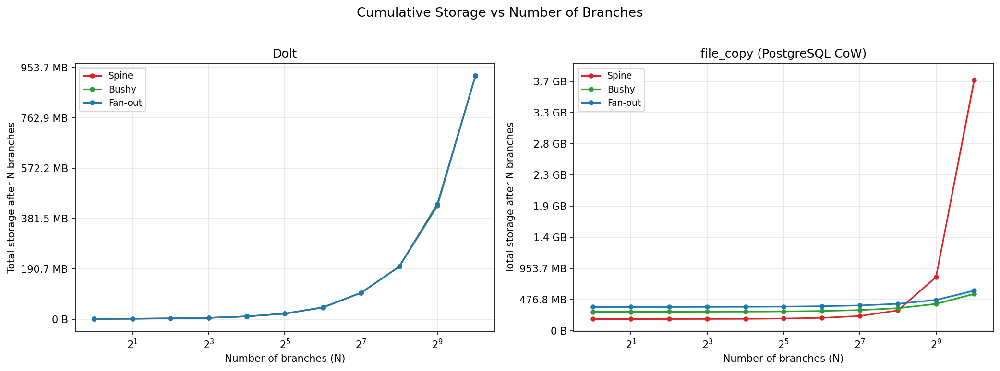
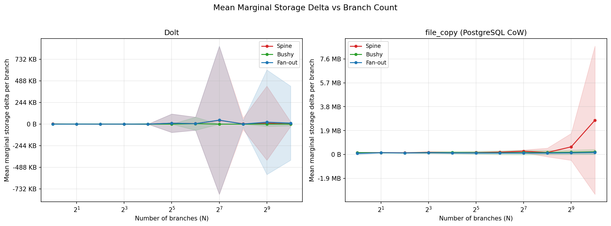

# Experiment 1: Branch Creation Storage Overhead (Varying Topology)

**Date**: 2026-02-09

## 1. Objective

Determine whether branch tree topology affects the marginal storage cost of
branch creation. Three topologies (spine, bushy, fan-out) are tested across
two backends (Dolt, file_copy/PostgreSQL CoW) at branch counts from 1 to 1024.

See [README.md](../README.md) for full methodology.

## 2. Methodology Summary

| Parameter | Value |
|-----------|-------|
| Backends | Dolt (content-addressed), file_copy (PostgreSQL CoW via filesystem copy) |
| Topologies | spine (linear chain), bushy (random parent), fan_out (all from root) |
| Branch counts (N) | 1, 2, 4, 8, 16, 32, 64, 128, 256, 512, 1024 |
| Iterations per config | 3 |
| Workload per branch | 100 INSERTs + 20 UPDATEs + 10 DELETEs (TPC-C orders) |
| Metric | `storage_delta = disk_size_after - disk_size_before` per branch creation |

**Storage measurement**: Dolt uses filesystem `st_blocks * 512` on its data
directory. file_copy uses `shutil.disk_usage()` on an isolated APFS volume.

**Total data**: 66 setup parquet files, 36,846 rows.

## 3. Results

### 3.1 Dolt: Topology Has No Effect on Storage

Dolt uses content-addressed storage where branches are lightweight pointers.
Creating a branch adds near-zero bytes regardless of topology or branch count.

| N | Spine (mean delta) | Bushy (mean delta) | Fan-out (mean delta) |
|---|---|---|---|
| 1 | 2.67 KB | 1.33 KB | 0 B |
| 8 | 171 B | 341 B | 683 B |
| 64 | 5.67 KB | 5.35 KB | 5.42 KB |
| 256 | 4.00 KB | 5 B | 1.51 KB |
| 1024 | 685 B | 343 B | 11.33 KB |

All deltas are dominated by occasional metadata flushes (most individual
branch creations have a delta of exactly 0 B). The cumulative storage at
N=1024 is ~923 MB for all three topologies, confirming that topology does not
affect Dolt's storage.

*Figure 1: Per-branch storage delta at N=1024. Dolt (left) shows near-zero deltas for all topologies. file_copy (right) shows spine diverging dramatically.*

### 3.2 file_copy: Spine Grows Superlinearly

For the file_copy backend (full PostgreSQL directory copy per branch), topology
has a dramatic effect on storage:

| N | Spine (mean delta) | Bushy (mean delta) | Fan-out (mean delta) |
|---|---|---|---|
| 1 | 152.00 KB | 154.67 KB | 86.67 KB |
| 8 | 171.17 KB | 155.83 KB | 147.00 KB |
| 64 | 190.17 KB | 145.54 KB | 122.12 KB |
| 256 | 167.42 KB | 162.17 KB | 120.44 KB |
| 512 | 623.78 KB | 181.08 KB | 137.12 KB |
| 1024 | **2.74 MB** | 212.14 KB | 165.02 KB |

At N=1024, spine's mean marginal delta is **17.0x** fan-out's, and **12.9x**
bushy's. This is because each spine branch copies an increasingly large parent
directory (the parent accumulates mutations from all prior branches in the chain).

### 3.3 Cumulative Storage

*Figure 2: Total storage after creating N branches. Dolt (left) shows topology-independent linear growth. file_copy (right) shows spine diverging superlinearly.*

| N | Dolt (all topos) | file_copy spine | file_copy bushy | file_copy fan-out |
|---|---|---|---|---|
| 1 | ~0.8 MB | 178 MB | 288 MB | 362 MB |
| 64 | ~44-45 MB | 196 MB | 301 MB | 374 MB |
| 256 | ~199 MB | 310 MB | 344 MB | 411 MB |
| 512 | ~430-435 MB | 822 MB | 410 MB | 470 MB |
| 1024 | ~923 MB | **3.75 GB** | 563 MB | 612 MB |

At N=1024, file_copy spine uses **6.1x** more storage than file_copy fan-out
and **6.7x** more than bushy. Meanwhile, Dolt uses ~923 MB for all topologies.

### 3.4 Topology Scaling Behavior

*Figure 3: Mean per-branch storage delta vs N. file_copy spine's cost accelerates at N>256, while bushy and fan-out remain approximately constant.*

For file_copy:
- **Fan-out**: marginal cost is nearly constant at ~120-165 KB/branch across all N
- **Bushy**: marginal cost grows slowly from ~155 KB to ~212 KB (1.4x over 1024 branches)
- **Spine**: marginal cost is stable at ~150-190 KB for N<=256, then jumps to 624 KB at N=512 and 2.74 MB at N=1024

### 3.5 Branch Creation Latency

| N | Dolt spine | Dolt fan-out | file_copy spine | file_copy fan-out |
|---|---|---|---|---|
| 1 | 7.9 ms | 7.6 ms | 42.7 ms | 118.7 ms |
| 64 | 7.8 ms | 8.1 ms | 47.2 ms | 68.1 ms |
| 256 | 8.0 ms | 8.1 ms | 40.1 ms | 58.4 ms |
| 512 | 8.1 ms | 7.9 ms | 75.2 ms | 60.0 ms |
| 1024 | 8.1 ms | 8.3 ms | **275.5 ms** | 64.1 ms |

Dolt branch creation takes ~8 ms regardless of topology or N.
file_copy spine latency grows with N (275 ms at N=1024) because it copies
a larger directory. file_copy fan-out latency is stable at ~60-70 ms for N>=64.

## 4. Research Question Answers

### RQ1: Does the marginal storage cost differ across topologies?

**Yes, for file_copy. No, for Dolt.**

- **Dolt**: All topologies produce near-zero marginal storage deltas. Content-addressed
  storage deduplicates identical data, and branch creation only adds a pointer.
  Topology has no measurable effect.

- **file_copy**: Spine's marginal cost grows superlinearly with N, reaching 2.74 MB/branch
  at N=1024 (17x fan-out's 165 KB). Bushy grows moderately (212 KB at N=1024, 1.3x fan-out).
  Fan-out is approximately constant.

### RQ2: Do any backends exhibit constant marginal cost regardless of topology?

**Yes: Dolt.** Its content-addressed storage architecture produces topology-invariant
branching costs. The per-branch delta is near-zero for all configurations.

### RQ3: Does fan-out produce lower or higher overhead than spine?

**Fan-out produces dramatically lower overhead for file_copy** (17x lower at N=1024).
For Dolt, the difference is negligible (both near-zero).

The mechanism is clear: in spine topology, each parent accumulates mutations from
all prior branches in the chain, so each successive copy is larger. In fan-out,
every branch copies from the unmodified root, keeping the copy size constant.

## 5. Neon Results (N<=8)

*These results are from a separate Neon run capped at 8 branches due to
platform limits. They are preserved here for completeness.*

| Shape   | Branch counts | Iterations |
|---------|---------------|------------|
| spine   | 1, 2, 4, 8   | 2          |
| bushy   | 1, 2, 4, 8   | 3          |
| fan_out | 1, 2, 4, 8   | 3          |

| N | Spine | Bushy | Fan-out |
|---|-------|-------|---------|
| 1 | 7,643,136 | 7,643,136 | 7,643,136 |
| 2 | 7,659,520 | 7,643,136 | 7,643,136 |
| 4 | 7,673,856 | 7,648,597 | 7,643,136 |
| 8 | 7,701,504 | 7,662,251 | 7,643,136 |

All values in bytes (mean marginal storage delta).

At N=8 the topology effect on Neon is small: spine is only 0.8% higher than
fan-out. Neon uses copy-on-write page references, so `pg_database_size()`
reports logical size rather than physical bytes added. Fan-out's delta is
constant because every branch forks from the unmodified root.

## 6. Limitations

- **Dolt storage measurement**: Uses `st_blocks * 512` on the data directory.
  On macOS APFS, cloned files may overcount `st_blocks` due to filesystem-level
  CoW that isn't visible at the stat level.
- **file_copy storage measurement**: Uses `shutil.disk_usage()` on an isolated
  APFS volume. This captures real disk consumption but includes filesystem
  overhead beyond raw data.
- **Neon**: Capped at 8 branches (platform limit). `pg_database_size()` reports
  logical size, not physical storage on the shared pageserver.
- **Single workload**: Only TPC-C orders table with fixed insert/update/delete
  counts. Different workloads may produce different topology sensitivity.
- **macOS only**: APFS filesystem behavior may differ from production Linux
  deployments using ext4 or XFS.
