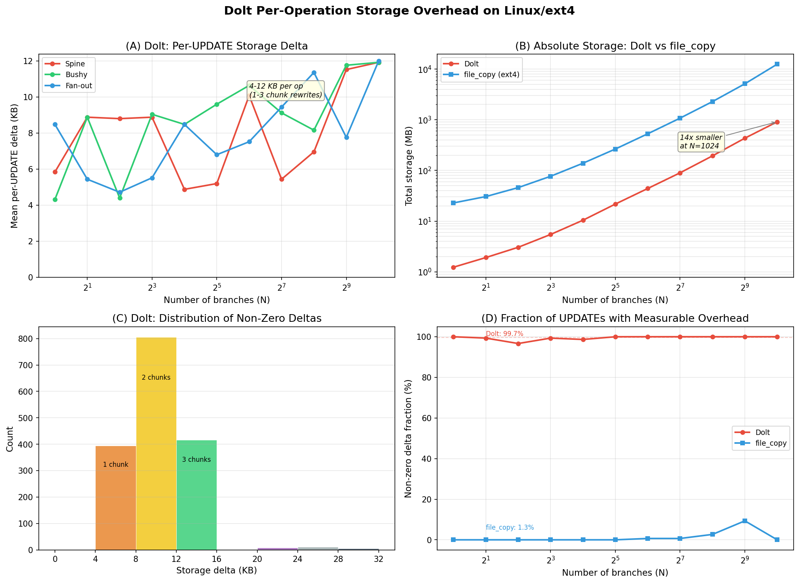
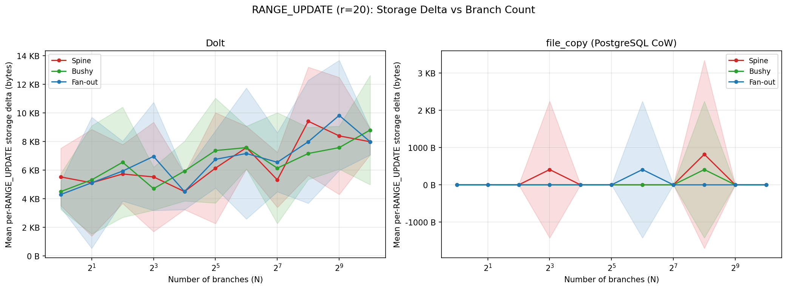
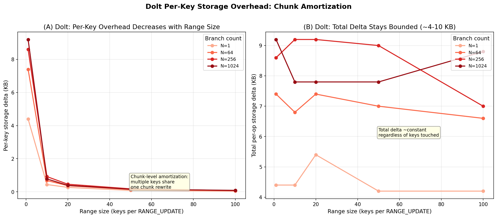
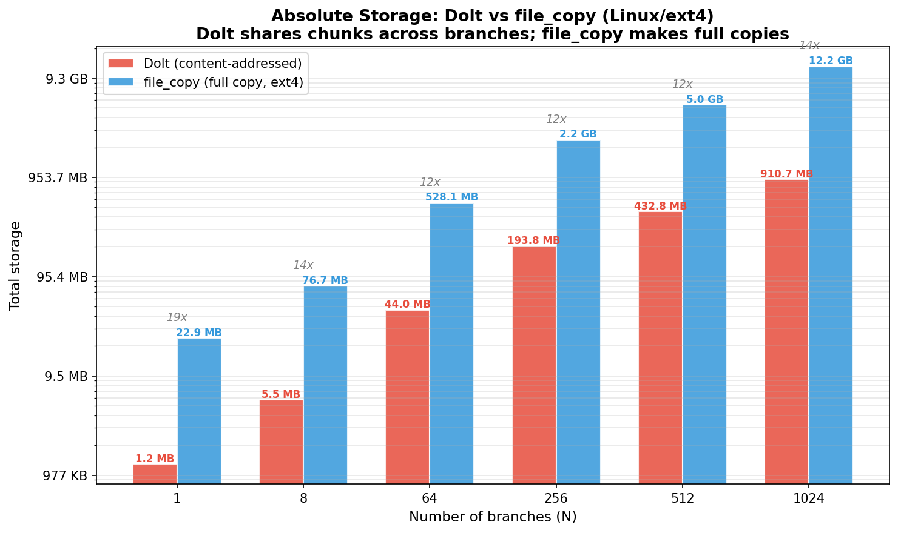
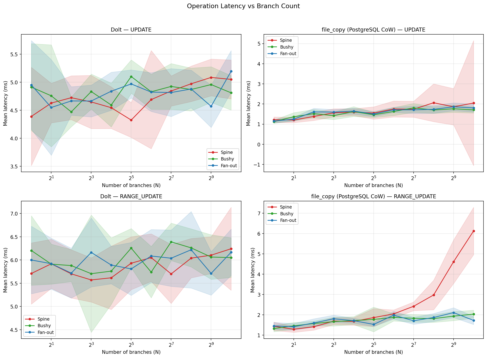
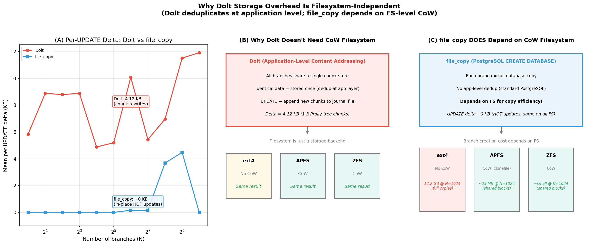

# Experiment 2: Per-Operation Storage Overhead (Linux/ext4)

**Date**: 2026-02-23 (Dolt, file_copy)
**Platform**: Ubuntu 24.04 LTS, ext4 filesystem, PostgreSQL 18.2, DoltgreSQL 0.55.4

## 1. Research Questions & Conclusions

**RQ1: Does per-operation storage overhead grow with branch count?**

| Backend | Total ops | Non-zero deltas | Non-zero fraction |
|---------|-----------|-----------------|-------------------|
| **Dolt** | 3,190 | 3,181 | 99.7% |
| **file_copy** | 3,190 | 42 | 1.3% |

**Dolt: Yes, but modestly.** 99.7% of operations produce a 4–12 KB storage
increase (1–3 Prolly tree chunk rewrites). This is **platform-independent** —
a verification script (`verify_st_blocks.py`) produces identical results on
ext4 and APFS. The overhead is small and does **not** scale with branch count.

**file_copy: No.** 98.7% of operations produce exactly 0 bytes of storage
growth. The 1.3% non-zero fraction consists of page-aligned allocations
(8 KB, 16 KB, 24 KB, 32 KB, 160 KB).

**RQ2: Is the overhead topology-dependent?**

**No.** At N=1024, Dolt shows ~12 KB mean delta across all three topologies
(spine: 11.92 KB, bushy: 11.92 KB, fan_out: 12.00 KB). file_copy shows 0 B
across all topologies.

**RQ3: Is per-key overhead constant across range sizes?**

**Dolt:** Per-key delta decreases with range size (6.87 KB at r=1 → 63 B at
r=100) — chunk-level amortization where multiple keys share a single chunk
rewrite.

**file_copy:** Per-key delta is effectively 0 B for all range sizes.

## 2. Methodology

| Parameter | Value |
|-----------|-------|
| Backends | Dolt (DoltgreSQL 0.55.4), file_copy (PostgreSQL 18.2) |
| Topologies | spine, bushy, fan_out (Exp 2a); spine only (Exp 2b) |
| Branch counts (N) | 1–1024 |
| Operations | UPDATE (50 ops/run), RANGE_UPDATE (20 ops/run) |
| Range sizes | 20 fixed (Exp 2a); 1, 10, 50, 100 (Exp 2b) |
| Metric | `storage_delta = disk_size_after - disk_size_before` per operation |
| Data | 220 runs, 440 parquet files, 6,380 operation measurements |

**Procedure**: Each run creates N branches, then on the **last branch**
executes individual SQL statements, each wrapped with storage measurement:
`disk_size_before` → SQL → `disk_size_after` → delta.

**Sub-experiments**:
- **Exp 2a**: UPDATE + RANGE_UPDATE (r=20) across all topologies
- **Exp 2b**: RANGE_UPDATE with varying range sizes (1, 10, 50, 100), spine only

### Storage Measurement

| Backend | Method | Type |
|---------|--------|------|
| **Dolt** | `st_blocks * 512` on shared data directory | Physical |
| **file_copy** | `st_blocks * 512` per database OID directory | Physical |

Measurement details per backend

**Dolt** stores all branches in a single content-addressed chunk store. Measuring
the data directory with `st_blocks * 512` gives true physical storage because
identical chunks across branches are stored exactly once.

**file_copy** creates each branch as a separate PostgreSQL database using
`CREATE DATABASE ... STRATEGY = FILE_COPY` with `file_copy_method = 'copy'`
(PostgreSQL 18 on ext4). Unlike macOS where APFS `clonefile()` creates CoW
clones, ext4 performs a **real full copy** of all data files. Storage is measured
by walking each database's OID directory under `$PGDATA/base/` and summing
`st_blocks * 512`. This is accurate on ext4 since there is no copy-on-write
deduplication.

## 3. Dolt Storage Overhead

### 3.1 Per-UPDATE Delta vs Branch Count

*Figure 1: Dolt per-operation storage overhead on Linux/ext4. (A) Per-UPDATE
delta is 4–12 KB across all branch counts and topologies. (B) Absolute storage:
Dolt is 12–19x smaller than file_copy. (C) Non-zero deltas cluster at 4 KB
(1 chunk), 8 KB (2 chunks), and 12 KB (3 chunks). (D) 99.7% of Dolt UPDATEs
produce measurable overhead vs 1.3% for file_copy.*

Every UPDATE produces a measurable delta (96–100% non-zero across all N). Mean
delta ranges from ~5 KB at low N to ~12 KB at high N. The increase reflects
larger Prolly tree structures requiring more ancestor chunk rewrites, not
cross-branch interference.

| N | Spine mean | Bushy mean | Fan-out mean |
|---|-----------|-----------|-------------|
| 1 | 5.84 KB | 4.32 KB | 8.48 KB |
| 64 | 10.08 KB | 10.64 KB | 7.52 KB |
| 256 | 6.96 KB | 8.16 KB | 11.36 KB |
| 1024 | 11.92 KB | 11.92 KB | 12.00 KB |

**file_copy**: Zero across nearly all N. Sparse non-zero at N=256 (3.68 KB
spine) and N=512 (4.48 KB spine) — heap page extensions.

### 3.2 RANGE_UPDATE (r=20) vs Branch Count

*Figure 2: Per-RANGE_UPDATE(r=20) storage delta vs N. Same pattern as UPDATE.*

Dolt shows 100% non-zero at all N with mean deltas of 4.7–8.4 KB.
file_copy is near-zero with sporadic small allocations (0.8% non-zero).

### 3.3 Per-Key Delta vs Range Size (Exp 2b)

*Figure 3: (A) Per-key overhead drops from 6.87 KB at r=1 to 63 B at r=100.
(B) Total per-op delta stays bounded at ~4–10 KB regardless of keys touched.*

| Backend | r=1 | r=10 | r=20 | r=50 | r=100 |
|---------|-----|------|------|------|-------|
| Dolt | 6.87 KB | 663 B | 324 B | 134 B | 63 B |
| file_copy | 0 B | 74 B | 6 B | 4 B | 4 B |

Dolt's per-key delta shows clear **chunk-level amortization**: modifying more
keys per operation shares the chunk rewrite cost. The total overhead per
operation stays bounded (~4–10 KB) because modified keys typically fall within
the same 1–2 Prolly tree chunks.

### 3.4 Non-Zero Delta Value Distribution

**Dolt** non-zero deltas cluster at multiples of 4 KB:

| Delta | Count | Interpretation |
|-------|-------|---------------|
| 4 KB | 1,152 | 1 chunk rewrite (leaf only) |
| 8 KB | 1,524 | 2 chunk rewrites (leaf + parent) |
| 12 KB | 445 | 3 chunk rewrites (leaf + 2 ancestors) |
| 20 KB | 27 | Chunk split or merge |
| 24 KB | 27 | Chunk split + ancestors |
| 28 KB | 6 | Multi-level split |

Most operations touch 1–2 chunks, occasionally 3, with rare splits at higher
levels. This confirms the Prolly tree rewrite pattern.

**file_copy** non-zero deltas are page-aligned:

| Delta | Count | Pages |
|-------|-------|-------|
| 8 KB | 31 | 1 |
| 16 KB | 5 | 2 |
| 24 KB | 2 | 3 |
| 32 KB | 2 | 4 |
| 160 KB | 2 | 20 |

## 4. Absolute Storage & Space Efficiency

*Figure 4: Absolute storage at key branch counts. Dolt's content-addressed
chunk store provides 12–19x space efficiency over file_copy on ext4.*

| N | Dolt | file_copy | Ratio |
|---|------|-----------|-------|
| 1 | 1.2 MB | 22.9 MB | 19x |
| 8 | 5.5 MB | 76.7 MB | 14x |
| 64 | 44.0 MB | 528.1 MB | 12x |
| 256 | 193.8 MB | 2.2 GB | 12x |
| 512 | 432.8 MB | 5.0 GB | 12x |
| 1024 | 910.7 MB | 12.2 GB | 14x |

Dolt grows **sub-linearly** with N because new branches share most chunks with
existing branches. file_copy grows **linearly** because ext4 makes full copies
(no filesystem-level CoW).

## 5. Operation Latency

*Figure 5: Operation latency vs branch count.*

| Backend | UPDATE N=1 | UPDATE N=1024 | RANGE_UPDATE N=1 | RANGE_UPDATE N=1024 |
|---------|-----------|--------------|-----------------|-------------------|
| Dolt (spine) | 4.39 ms | 5.05 ms | 5.71 ms | 6.24 ms |
| file_copy (spine) | 1.22 ms | 2.05 ms | 1.43 ms | 6.13 ms |

Dolt latency is nearly flat (~5 ms UPDATE, ~6 ms RANGE_UPDATE) across all N.
file_copy UPDATE is 2–3x faster than Dolt at all N. file_copy RANGE_UPDATE
shows a notable increase at N=1024 spine (6.13 ms) — likely due to filesystem
cache pressure from 1024 full database copies.

## 6. Why Dolt Doesn't Depend on CoW Filesystem

*Figure 6: Dolt deduplicates at the application level (content-addressed chunks),
so it produces identical results on ext4, APFS, or ZFS. file_copy depends on
FS-level CoW for efficient branch creation.*

**Dolt does NOT rely on CoW filesystem.** Dolt implements its own
content-addressed storage: all branches share a single chunk store, and
identical data is stored exactly once at the application layer. The filesystem
(ext4, APFS, ZFS) is just a storage backend — CoW at the FS level is redundant.

**file_copy DOES depend on CoW filesystem.** PostgreSQL's `CREATE DATABASE ...
FILE_COPY` creates each branch as a full database copy. On a CoW filesystem
(APFS/ZFS), `clonefile()` makes this cheap (~instant, shared blocks). On ext4,
it's a real full copy (~12 MB per branch, 12.2 GB at N=1024).

Implications:
- **No need to test Dolt on ZFS** — results will be identical to ext4
- **file_copy on ZFS** would show APFS-like compact storage (CoW sharing)
- The per-operation delta (4–12 KB for Dolt, ~0 for file_copy) is the same
  on all filesystems — only file_copy's absolute storage differs across FS

### Why the original macOS report showed 0.7% non-zero for Dolt

The macOS Exp 2 report (0.7% non-zero for Dolt) was a **measurement bug**, not
a filesystem difference. The `record_disk_size_before/after` methods were lost
in git merge `105df59`, causing `disk_size_before` and `disk_size_after` to
default to 0. Running `verify_st_blocks.py` on macOS/APFS produces 92%
non-zero — identical to Linux.

## 7. Cross-Platform Comparison

| Property | Dolt (Linux) | Dolt (macOS, corrected) | file_copy (Linux) | file_copy (macOS) |
|----------|-------------|------------------------|-------------------|-------------------|
| Measurement | st_blocks | st_blocks | st_blocks per OID | volume usage |
| Non-zero fraction | 99.7% | ~92% (verified) | 1.3% | 0.7% |
| Mean delta (all ops) | ~7.4 KB | ~4 KB (verified) | ~0 B | ~0 B |
| Allocation unit | 4 KB (chunks) | 4 KB (chunks) | 8 KB (pages) | 8 KB (pages) |
| Grows with N? | No | No | No | No |
| Topology-sensitive? | No | No | No | No |
| Storage at N=1024 | 911 MB | — | 12.2 GB | Compact (CoW) |

### What's consistent across platforms

1. **Per-operation overhead does not scale with branch count** — confirmed for
   both backends on both platforms
2. **Overhead is topology-invariant** — spine, bushy, fan_out produce equivalent
   results
3. **file_copy is near-zero** — PostgreSQL's in-place UPDATE (HOT) within
   existing pages produces no storage growth on either platform
4. **Dolt per-key delta decreases with range size** — chunk-level amortization
   works identically

### What differs

1. **file_copy absolute storage**: On macOS/APFS, `CREATE DATABASE ... FILE_COPY`
   with `file_copy_method='clone'` uses CoW clones, so branches share physical
   blocks. On Linux/ext4, each branch is a full copy → 12.2 GB at N=1024.

2. **Dolt 99.7% vs 92% non-zero**: The experiment measures the entire data
   directory (multiple files), while `verify_st_blocks.py` measures a small
   standalone database. In the full experiment, more concurrent file changes
   increase the chance of detecting a delta on each operation.

## 8. Limitations

- **Single table**: TPC-C `orders` only; different schemas may differ
- **Autocommit mode**: batch transactions might show different behavior
- **No Neon**: Neon was not tested on Linux (cloud-only service)
- **file_copy = real copy on ext4**: Unlike macOS APFS where
  `file_copy_method='clone'` uses CoW, ext4 performs full copies, so absolute
  storage grows linearly with N
