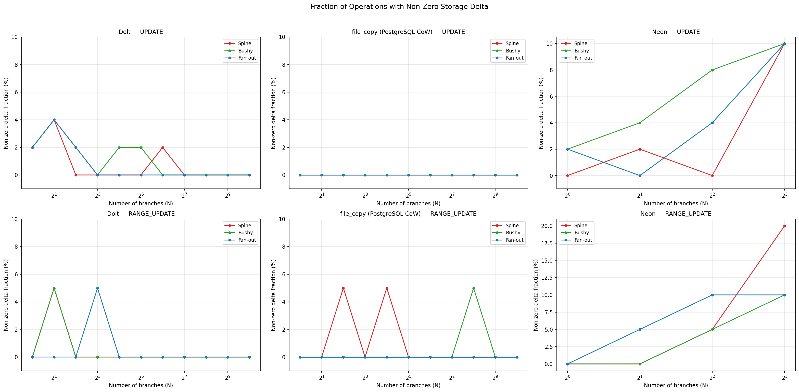

# Experiment 2: Per-Operation Storage Overhead

**Date**: 2026-02-10 (Dolt, file_copy), 2026-02-11 (Neon)

## 1. Research Questions & Conclusions

**Motivation**: In a CoW branching system, branches share underlying data. When
you UPDATE a shared page on one branch, the system must allocate new storage
for the diverged copy. The concern is: *if N branches all share the same
pages, does modifying one branch become more expensive because N-1 other
branches still reference the old version?* This experiment answers that by
creating N branches, then measuring `storage_delta` around each individual
SQL statement on the last branch.

**RQ1: Does per-operation storage overhead grow with branch count?**

**No.** All three backends show near-zero per-operation storage delta regardless
of N or topology. >99% of operations produce exactly 0 bytes of storage growth
for Dolt and file_copy.

| Backend | Total ops | Non-zero deltas | Non-zero fraction |
|---------|-----------|-----------------|-------------------|
| Dolt | 3,190 | 21 | 0.7% |
| file_copy | 3,190 | 22 | 0.7% |
| Neon | 1,160 | 72 | 6.2% |

**RQ2: Is the overhead topology-dependent?**

**No.** Unlike branch creation (Experiment 1), per-operation storage overhead
is topology-invariant for all backends. Once a branch exists, modifications
on it are isolated — the number and arrangement of other branches does not
affect write amplification.

**RQ3: Is per-key overhead constant across range sizes?**

**Effectively yes.** For Dolt and file_copy, per-key delta is 0 B for all
range sizes (median). For Neon, per-key delta *decreases* with range size
(614 B at r=1 → 13 B at r=100) due to page-level amortization: one 8 KB
page allocation spread across more keys.

## 2. Methodology

| Parameter | Value |
|-----------|-------|
| Backends | Dolt, file_copy (PostgreSQL CoW), Neon |
| Topologies | spine, bushy, fan_out (Exp 2a); spine only (Exp 2b) |
| Branch counts (N) | 1–1024 (Dolt, file_copy); 1–8 (Neon, platform limit) |
| Operations | UPDATE (50 ops/run), RANGE_UPDATE (20 ops/run) |
| Range sizes | 20 fixed (Exp 2a); 1, 10, 50, 100 (Exp 2b) |
| Metric | `storage_delta = disk_size_after - disk_size_before` per operation |
| Data | 260 runs, 520 parquet files, 7,540 operation measurements |

**Procedure**: Each run follows four phases:
1. **Initialize** — fresh database with TPC-C orders schema
2. **Branch setup** — create N branches using the topology's parent rule
3. **Operation measurement** — on the **last created branch**, execute
   individual SQL statements, each wrapped with storage measurement:
   `disk_size_before` → 1 SQL statement → `disk_size_after` → compute delta.
   Repeated 50× for UPDATE, 20× for RANGE_UPDATE.
4. **Cleanup** — drop the database

**Sub-experiments**:
- **Exp 2a**: UPDATE + RANGE_UPDATE (r=20) across all topologies. Does per-op
  overhead grow with N or vary by topology?
- **Exp 2b**: RANGE_UPDATE with varying range sizes (1, 10, 50, 100), spine
  only. Is per-key overhead constant?

### Storage Measurement

| Backend | Method | Type | CoW-aware? |
|---------|--------|------|------------|
| **Dolt** | `st_blocks * 512` on shared data directory | Physical | Yes |
| **file_copy** | `shutil.disk_usage()` on isolated APFS volume | Physical | Yes |
| **Neon** | `pg_database_size()` per branch, summed | Logical | No |

Measurement details per backend

**Dolt** stores all branches in a single content-addressed chunk store. Measuring
the data directory with `st_blocks * 512` gives true physical storage because
identical chunks across branches are stored exactly once. This is the
[recommended approach](https://github.com/dolthub/dolt/issues/6624) from the
Dolt team.

**file_copy** creates each branch as a separate PostgreSQL database using
`CREATE DATABASE ... STRATEGY = FILE_COPY` with `file_copy_method = 'clone'`
(PostgreSQL 18+). On macOS, this calls APFS `clonefile()` to create
copy-on-write clones of the parent's data files. We measure total storage via
`shutil.disk_usage()` on a dedicated APFS volume that contains only the
PostgreSQL data directory. Volume isolation ensures the measurement captures
only PostgreSQL activity and correctly reflects CoW block sharing.

**Neon** measures storage via `pg_database_size()`, which reports the **logical**
size of each branch's database. This does **not** reflect copy-on-write page
sharing between branches. As Neon's own documentation states:

> "If you have a database with 1 GB logical size and you create a branch of it,
> both branches will have 1 GB logical size, even though the branch is
> copy-on-write and won't consume any extra physical disk space until you make
> changes to it."
> — [Neon Glossary](https://github.com/neondatabase/neon/blob/main/docs/glossary.md)

The only CoW-aware alternative (`synthetic_storage_size`) updates every 15–60
minutes and is project-level only, making it unsuitable for per-operation
measurement.

## 3. Results

### 3.1 Non-Zero Delta Distribution

The rare non-zero deltas cluster at backend-specific allocation boundaries:

| Backend | Allocation sizes | Pattern |
|---------|-----------------|---------|
| **Dolt** | 16 KB (3), 64 KB (7), 1 MB (11) | Chunk splits/merges |
| **file_copy** | 8 KB (13), 16 KB (2), 64 KB (2), 1 MB (1) | Page allocations |
| **Neon** | 8 KB (70), 16 KB (2) | Page allocations |

### 3.2 Point UPDATE vs Branch Count

*Figure 1: Per-UPDATE storage delta vs N. Near-zero for all backends with no
growth trend.*

- **Dolt**: Sporadic non-zero at low N (2–4%), zero at N≥8
- **file_copy**: Zero across all N and topologies
- **Neon**: Slight upward trend (0–2% at N=1 → 10% at N=8), all non-zero = 8 KB

### 3.3 RANGE_UPDATE (r=20) vs Branch Count

*Figure 2: Per-RANGE_UPDATE(r=20) storage delta vs N. Same pattern: sporadic
non-zero, no systematic trend.*

### 3.4 Non-Zero Fraction vs Branch Count

*Figure 3: Fraction of operations producing non-zero deltas vs N. Sporadic
events uncorrelated with branch count.*

### 3.5 Per-Key Delta vs Range Size (Exp 2b)

*Figure 4: Per-key storage delta across range sizes (spine topology).*

| Backend | r=1 | r=10 | r=20 | r=50 | r=100 |
|---------|-----|------|------|------|-------|
| Dolt | 0 B | 506 B | 15 B | 101 B | 0 B |
| file_copy | 0 B | 0 B | 4 B | 16 B | 59 B |
| Neon | 614 B | 51 B | 26 B | 23 B | 13 B |

Dolt/file_copy medians are 0 B for all range sizes (means dominated by rare
outliers). Neon's per-key delta decreases with range size — page-level
amortization.

## 4. Analysis

### 4.1 Why Per-Operation Overhead Is Near-Zero

**Dolt**: Content-addressed Prolly tree rewrites only affected leaf chunk +
ancestors. If rewritten chunks fit in allocated space, total storage unchanged.
Non-zero deltas (0.7%) are chunk splits/merges at fixed sizes (16 KB/64 KB/1 MB),
uncorrelated with branch count. Each branch operates on its own tree root —
no cross-branch write amplification.

**file_copy**: Each branch is an independent PostgreSQL database. UPDATEs
modify heap pages in-place (HOT updates or within existing free space).
Already-allocated pages don't increase volume usage. Non-zero deltas (0.7%)
are new page allocations (heap extension, index growth), uncorrelated with
branch count.

**Neon**: Higher non-zero fraction (6.2%) because `pg_database_size()` detects
every page-level allocation that `shutil.disk_usage()` may miss. The slight
upward trend with N (10% at N=8) suggests more shared pages → more likely to
trigger new allocations, but the absolute delta remains tiny (mean < 1.6 KB
at N=8 vs ~7.3 MB per branch creation).

### 4.2 Why Per-Key Overhead Decreases with Range Size (Neon)

Storage allocation is page/chunk-level, not row-level. A RANGE_UPDATE touching
multiple keys on the same page triggers at most one 8 KB page allocation.
Dividing across more keys → lower per-key cost. For Dolt/file_copy, this is
moot since per-op delta is almost always 0 B regardless of range size.

### 4.3 Cross-Backend Summary

| Property | Dolt | file_copy | Neon |
|----------|------|-----------|------|
| Measurement type | Physical | Physical | Logical |
| Non-zero fraction | 0.7% | 0.7% | 6.2% |
| Allocation unit | 16 KB–1 MB (chunks) | 8 KB multiples (pages) | 8 KB (pages) |
| Grows with N? | No | No | Slight trend (N≤8) |
| Topology-sensitive? | No | No | No |
| Mean delta at max N | 0 B | 0 B | ~819 B |

**Per-operation storage overhead does not scale with branch count.** The
dominant factor is internal storage management (chunk splits, page
allocations), not the number of branches.

### 4.4 Limitations

- **Measurement granularity**: volume-level measurement captures page/chunk
  allocations but not in-place modifications within existing pages
- **Single table**: TPC-C `orders` only; different schemas may differ
- **Autocommit mode**: batch transactions might show different behavior
- **Neon limited to N=8**: cannot confirm flat trend at higher N
- **macOS only**: APFS behavior may differ from Linux ext4/XFS
