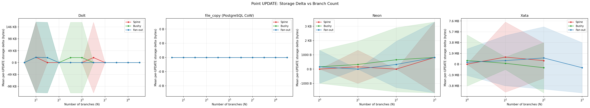
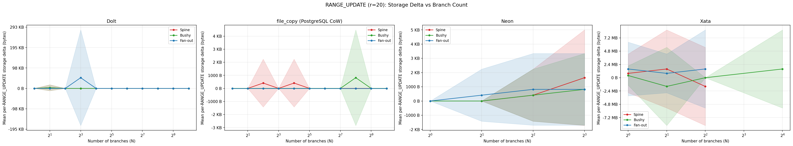
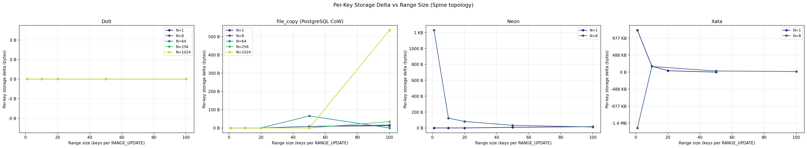
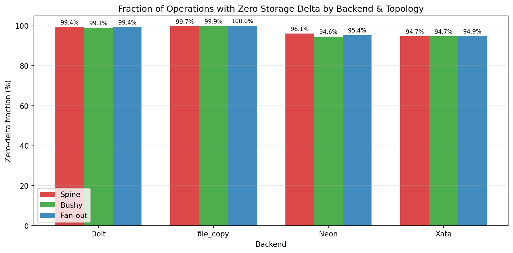
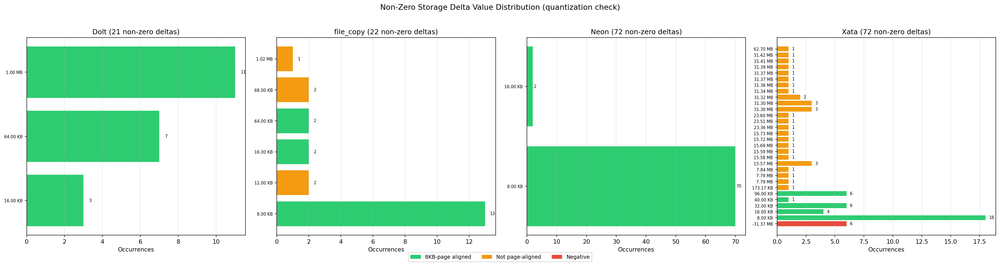

# Experiment 2: Per-Operation Storage Overhead

**Date**: 2026-02-10 (Dolt, file_copy), 2026-02-11 (Neon), 2026-02-25~26 (Xata)

## 0. Summary

| Backend | Measurement type | Key finding | Max N measured |
| --- | --- | --- | --- |
| **Dolt** | Physical (`st_blocks * 512`) | 99.34% zero deltas overall; non-zero values are only `{16 KB, 64 KB, 1 MB}` | 1024 |
| **file_copy** | Physical (isolated APFS `disk_usage`) | 99.31% zero deltas overall; non-zero values are `{8 KB, 12 KB, 16 KB, 64 KB, 68 KB, 1,069,056 B}` | 1024 |
| **Neon** | Logical (`pg_database_size()` sum) | Higher non-zero fraction (6.21%); non-zero values are exactly `70 × 8 KB` and `2 × 16 KB` | 8 |
| **Xata** | Logical (branch metrics API `disk`) | 32/1,014 rows have zero disk metrics and are filtered; filtered rows still show 7.33% non-zero with large MB-scale jumps | 16 (partial valid coverage) |

## 1. Experiment Procedure

One repetition for a given backend, N, topology, and operation:

1. Create fresh database.
2. Run branch setup (same as Exp 1): create N branches with topology rule, writing setup data on each branch.
3. On setup output branch, run measured operations:
   - `UPDATE`: 50 ops/run
   - `RANGE_UPDATE`: 20 ops/run
4. For each measured op, record `disk_size_before`, execute SQL, record `disk_size_after`, flush one row.

### Configurations

| Parameter | Value |
| --- | --- |
| Backends | Dolt, file_copy, Neon, Xata |
| Topologies | `spine`, `bushy`, `fan_out` (Exp 2a); `spine` only (Exp 2b) |
| Branch counts (N) | 1–1024 (Dolt, file_copy), 1–8 (Neon), 1–16 (Xata) |
| Operations | `UPDATE`, `RANGE_UPDATE` |
| Range sizes | Exp 2a: `r=20`; Exp 2b: `r=1,10,50,100` (plus `r=20` from Exp 2a for per-key comparison) |
| Measurement data | 310 measurement parquets, 8,554 measurement rows |

### Measured row counts (recomputed from parquet)

| Sub-experiment | Dolt | file_copy | Neon | Xata |
| --- | ---: | ---: | ---: | ---: |
| **Exp 2a** (`UPDATE` + `RANGE_UPDATE r=20`) | 2,310 | 2,310 | 840 | 710 |
| **Exp 2b** (`RANGE_UPDATE r=1,10,50,100`, spine) | 880 | 880 | 320 | 304 |
| **Total** | 3,190 | 3,190 | 1,160 | 1,014 |

### Storage Measurement

| Backend | Method | Type | CoW-aware? |
| --- | --- | --- | --- |
| **Dolt** | `st_blocks * 512` on shared Dolt data directory | Physical | Yes |
| **file_copy** | `shutil.disk_usage()` on isolated APFS volume | Physical | Yes |
| **Neon** | `pg_database_size()` per branch, summed | Logical | No |
| **Xata** | Branch metrics API (`metric=disk`, 5-minute window, `max`), summed | Logical per instance | No |

## 2. Metrics

Per-operation storage delta:

```text
storage_delta = disk_size_after - disk_size_before
```

Per-key storage delta (RANGE_UPDATE rows):

```text
per_key_delta = storage_delta / num_keys_touched
```

Xata filtering rule used in storage analyses:

```text
drop row if backend == xata and (disk_size_before == 0 or disk_size_after == 0)
```

Recomputed Xata filtered rows: **32 / 1,014** (3.16%), leaving **982** valid rows.

Why these rows are dropped for delta analysis:
- Xata `disk` comes from a windowed metrics API, and zero values in this dataset occur when metrics are not yet available (sampling lag), not when true storage is zero.
- Including those rows in `storage_delta` would create artificial jumps (for example, `0 -> positive` or `positive -> 0`) that do not represent one SQL statement's storage effect.
- Therefore, raw row counts are retained for coverage reporting, but zero-metric rows are excluded from storage-delta calculations.

## 3. Research Questions

### 3.1 RQ-to-Evidence Mapping

| RQ | Primary evidence | Role |
| --- | --- | --- |
| **RQ1**: Does per-operation storage overhead grow with branch count? | Exp 2a means vs N + Figure 2a/2b + Table 4.1 | Primary answer |
| **RQ2**: Is overhead topology-dependent? | Exp 2a zero-delta-by-topology table + Figure 2f | Primary answer |
| **RQ3**: Is per-key storage overhead constant across range sizes? | Spine per-key table (`r=1,10,20,50,100`) + Figure 2c | Primary answer |

### 3.2 RQ1 — Growth with branch count

**RQ1: Does per-operation storage overhead grow with branch count?**

| Backend | Non-zero fraction (Exp 2a) | Mean at max N (UPDATE) | Mean at max N (RANGE_UPDATE r=20) | Answer |
| --- | ---: | ---: | ---: | --- |
| **Dolt** | 17/2310 (0.74%) | 0 B (`N=1024`) | 0 B (`N=1024`) | No monotonic growth signal. |
| **file_copy** | 3/2310 (0.13%) | 0 B (`N=1024`) | 0 B (`N=1024`) | No monotonic growth signal. |
| **Neon** | 39/840 (4.64%) | 819 B (`N=8`) | 1,092 B (`N=8`) | Mild increase at low N only. |
| **Xata** (filtered) | 36/691 (5.21%) | no valid rows at `N=16` (0/3) | 1,642,432 B (`N=16`, 20 valid rows, bushy only) | Non-monotonic/noisy; high-N coverage is partial. |

Conclusion: no backend shows a clean monotonic growth curve across available N; Neon shows small low-N increases, and Xata is noisy with sparse high-N valid rows.

### 3.3 RQ2 — Topology dependence

**RQ2: Is the growth rate backend-dependent or topology-dependent?**

Evidence metric: Exp 2a zero-delta fraction by topology (Xata filtered).

| Backend | Spine | Bushy | Fan-out | Spread (pp) |
| --- | ---: | ---: | ---: | ---: |
| **Dolt** | 99.35% | 99.09% | 99.35% | 0.26 |
| **file_copy** | 99.74% | 99.87% | 100.00% | 0.26 |
| **Neon** | 96.07% | 94.64% | 95.36% | 1.43 |
| **Xata** (filtered) | 94.71% | 94.74% | 94.90% | 0.19 |

Conclusion: topology effect is weak for Dolt, file_copy, and Xata in this dataset; Neon shows the largest spread (~1.4 pp), still modest.

Coverage caveat for Xata Exp 2a: after filtering, common topology coverage is effectively strong only up to `N=4`; `N=8` and `N=16` are sparse/partial.

### 3.4 RQ3 — Per-key constancy across range sizes

**RQ3: Is per-key storage overhead constant across range sizes, or does amortization/amplification appear?**

Evidence metric: mean `per_key_delta` on spine RANGE_UPDATE rows (`r=1,10,20,50,100`), with medians also checked.

| Backend | r=1 | r=10 | r=20 | r=50 | r=100 | Median pattern |
| --- | ---: | ---: | ---: | ---: | ---: | --- |
| **Dolt** | 0 B | 506 B | 14.9 B | 101 B | 0 B | all medians = 0 B |
| **file_copy** | 0 B | 0 B | 3.7 B | 15.6 B | 59.0 B | all medians = 0 B |
| **Neon** | 614 B | 51.2 B | 25.6 B | 22.5 B | 13.3 B | all medians = 0 B |
| **Xata** (filtered) | -410 B | 187,315 B | 13,595 B | 24,390 B | 17,345 B | all medians = 0 B |

Conclusion: no single constant per-key model fits all backends. Neon shows clear per-key decrease with larger ranges; Dolt/file_copy are mostly zero with sparse outliers; Xata is unstable/non-monotonic.

## 4. Results

### 4.1 Non-zero quantization tables (verified)

| Backend | Non-zero count | Unique non-zero values | Verification result |
| --- | ---: | --- | --- |
| **Dolt** | 21 | `{16 KB, 64 KB, 1 MB}` | Correct; unlike Exp 1, `4 KB` and `16 MB` are absent here. |
| **file_copy** | 22 | `{8 KB, 12 KB, 16 KB, 64 KB, 68 KB, 1,069,056 B}` | `17/22` are 8KB multiples; `5/22` are 4KB-aligned but not 8KB-aligned. |
| **Neon** | 72 | `{8 KB, 16 KB}` | Exactly `70 × 8 KB` and `2 × 16 KB`. |
| **Xata** | 74 unfiltered; 72 filtered | Mixed page and MB-scale values | Unfiltered split is `35/33/6` (8KB-aligned positive / non-8KB positive / negative); filtered split is `35/31/6`. |

Xata MB-scale values are concentrated near approximately `7.8 MB`, `15.6 MB`, `23.4 MB`, `31.3 MB`, and `62.7 MB`, with negative jumps at `-31.366 MB`.

### 4.2 Point UPDATE vs branch count (Figure 2a)



Observed from plotted data:
- Dolt and file_copy are near-zero across N with sparse non-zero events.
- Neon has low-magnitude page-sized non-zero values.
- Xata shows high variance and missing/filtered high-N UPDATE rows (`N=16` UPDATE has no valid rows).

### 4.3 RANGE_UPDATE (`r=20`) vs branch count (Figure 2b)



Observed from plotted data:
- Dolt and file_copy remain mostly zero.
- Neon remains low-magnitude and page-quantized.
- Xata has sparse but large jumps; at `N=16`, valid rows are bushy-only.

### 4.4 Per-key delta vs range size (Figure 2c)



Observed from plotted data:
- Dolt/file_copy are dominated by zeros with occasional outliers.
- Neon per-key means decrease as range size grows.
- Xata per-key means are non-monotonic and high-variance.

### 4.5 Zero-delta by topology (Figure 2f)



Observed from plotted data:
- All backends have high zero-delta rates.
- Neon has the largest topology spread (~1.4 pp).
- Xata topology percentages are similar but based on uneven valid-row coverage at higher N.

### 4.6 Non-zero quantization (Figure 2g)



Observed from plotted data:
- Dolt and Neon occupy a few discrete bins.
- file_copy has a small finite set of 4KB/8KB-aligned values.
- Xata includes both page-scale and large MB-scale positive/negative jumps.

## 5. Notable Observations

- Xata filtering is material: **32/1,014** rows dropped due to zero disk metrics from the API.
- Xata zero-metric rows are treated as missing metric samples (not true zero storage): kept in raw coverage counts, excluded from `storage_delta` math.
- Xata Exp 2a high-N coverage is partial after filtering (`N=8` and `N=16` are sparse across topologies/ops).
- Medians of per-key delta are 0 B for all backends/ranges; mean values are driven by sparse non-zero outliers.
- file_copy Exp 2a non-zero rate is much lower than aggregate Exp 2 (0.13% in Exp 2a vs 0.69% overall) because most file_copy non-zero events appear in Exp 2b range sweeps.
- Neon and Xata numbers are logical metrics, not direct physical CoW byte attribution.

## 6. Hypotheses for Analysis

### 6.1 Dolt power-of-2 quantization

**Observed**:
- Exp 2 non-zero deltas are only `{16 KB, 64 KB, 1 MB}` (21 events).
- Exp 1 showed a broader Dolt set `{4 KB, 16 KB, 64 KB, 1 MB, 16 MB}`.

**Hypothesis**:
- Exp 2 is consistent with the same quantized allocation behavior seen in Exp 1, but this workload/sampling window did not hit Dolt’s smaller (`4 KB`) or larger (`16 MB`) jumps.

TBD

## 7. Traceability references

### Data and scripts

- **[S1]** Raw data: `/Users/garfield/PycharmProjects/db-fork/experiments/experiment-2-2026-02-08/results/data/*.parquet`
- **[S2]** Numeric analysis script: `/Users/garfield/PycharmProjects/db-fork/experiments/experiment-2-2026-02-08/results/scripts/01_analyze.py`
- **[S3]** Zero-delta/quantization script: `/Users/garfield/PycharmProjects/db-fork/experiments/experiment-2-2026-02-08/results/scripts/04_zero_delta_and_quantization.py`

### Measurement implementation

- **[S5]** Per-op before/after storage wrapper and runner flow:
  - `/Users/garfield/PycharmProjects/db-fork/dblib/storage.py`
  - `/Users/garfield/PycharmProjects/db-fork/microbench/runner.py`
  - `/Users/garfield/PycharmProjects/db-fork/bench_lib.sh`
- **[S6]** Dolt storage implementation: `/Users/garfield/PycharmProjects/db-fork/dblib/dolt.py`, `/Users/garfield/PycharmProjects/db-fork/dblib/util.py`
- **[S7]** file_copy storage implementation: `/Users/garfield/PycharmProjects/db-fork/dblib/file_copy.py`, `/Users/garfield/PycharmProjects/db-fork/dblib/util.py`
- **[S8]** Neon storage implementation: `/Users/garfield/PycharmProjects/db-fork/dblib/neon.py`
- **[S9]** Xata storage implementation: `/Users/garfield/PycharmProjects/db-fork/dblib/xata.py`

### External docs

- **[S10]** Dolt maintainer guidance on disk sizing: <https://github.com/dolthub/dolt/issues/6624>
- **[S11]** Neon glossary on logical vs physical branch size: <https://github.com/neondatabase/neon/blob/main/docs/glossary.md>
- **[S12]** PostgreSQL `file_copy_method`: <https://postgresqlco.nf/doc/en/param/file_copy_method/>
- **[S13]** Xata branch metrics API: <https://docs.xata.io/reference/post-branch-metrics>
