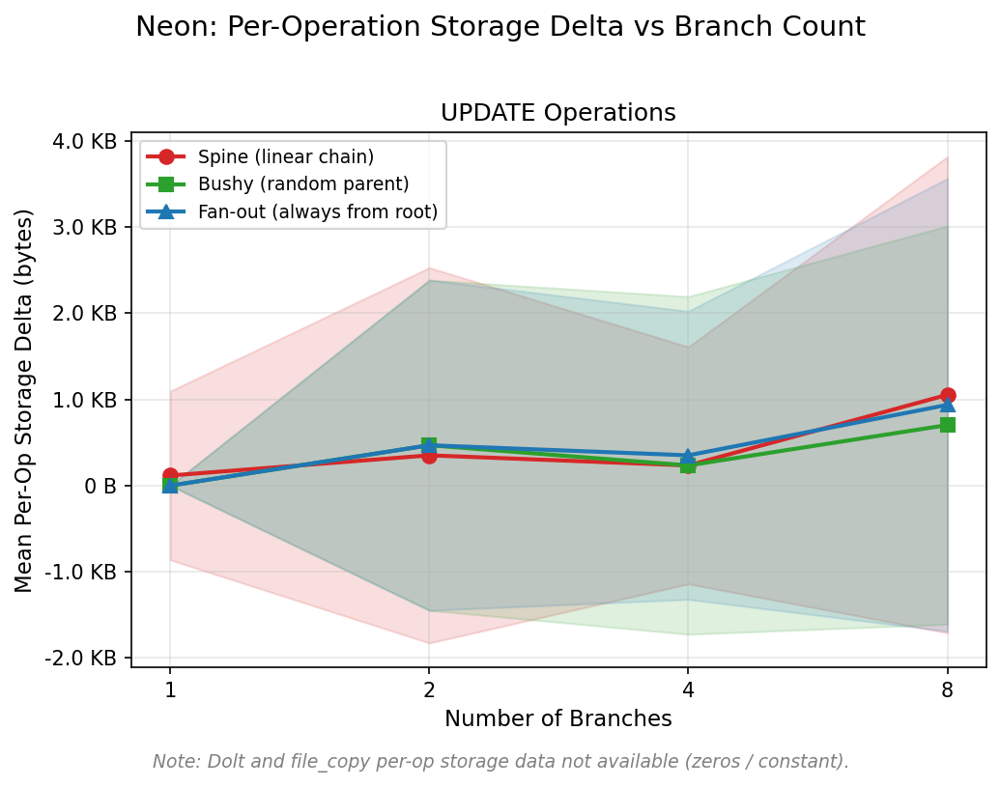

# Experiment 2: Per-Operation Storage Overhead (Neon)

**Date**: 2026-02-09

## Objective

Measure whether the per-UPDATE storage delta grows with branch count or varies
by topology on Neon.

## Data

| Shape   | Branch counts | Ops per config | Op type |
|---------|---------------|----------------|---------|
| spine   | 1, 2, 4, 8   | 70             | UPDATE  |
| bushy   | 1, 2, 4, 8   | 70             | UPDATE  |
| fan_out | 1, 2, 4, 8   | 70             | UPDATE  |

Per-op delta = `disk_size_after - disk_size_before` for each UPDATE statement.

## Results

### Mean per-op storage delta

| N | Spine (bytes) | Bushy (bytes) | Fan-out (bytes) |
|---|---------------|---------------|-----------------|
| 1 | 117           | 0             | 0               |
| 2 | 351           | 468           | 468             |
| 4 | 234           | 234           | 351             |
| 8 | 1,053         | 702           | 936             |

### Raw delta distribution

Every individual delta is an exact multiple of 8 KB (one PostgreSQL page):

| Delta     | Count | Fraction |
|-----------|-------|----------|
| 0 bytes   | 800   | 95.2%    |
| 8,192 (1 page)  | 38    | 4.5%     |
| 16,384 (2 pages) | 2     | 0.2%     |

The means in the table above (117, 351, etc.) are weighted averages of these
three discrete values. See `02_delta_distribution.py` for verification.

## Why These Results

`pg_database_size()` reports the total size of files backing the database. It
only changes when new 8 KB pages are **allocated** (table or index grows), not
when existing pages are modified in place.

- **Deltas are tiny** — all means are under 1.1 KB, vs ~7.6 MB per branch
  creation (exp1). Per-operation write amplification from branching is
  negligible.

- **Strictly page-granular** — each UPDATE either fits on an existing page
  (delta = 0) or triggers allocation of 1-2 new pages (delta = 8 KB or
  16 KB). The 16 KB case likely involves both a heap page and an index page.

- **No topology effect** — the three topologies produce similar deltas within
  noise. Unlike branch creation (where spine forks from an ever-growing
  parent), UPDATEs always run on the same single branch regardless of how
  that branch was created. The topology of the tree above the working branch
  does not affect page allocation.

- **Slight upward trend at N=8** — more page allocations occur at higher
  branch counts, but the effect is small and noisy at this scale.

## Limitations

- Capped at 8 branches (Neon platform limit).
- Only UPDATE measured (no RANGE_UPDATE in this run).
- Page-level granularity means 95% of ops report 0, limiting statistical power.

## Scripts

| Script | Purpose |
|--------|---------|
| `01_storage_fig.py` | Per-op storage delta figure |
| `02_delta_distribution.py` | Verify all deltas are exact multiples of 8 KB |
