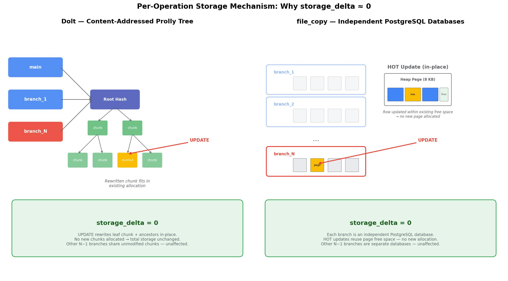

# Experiment 2: Per-Operation Storage Overhead

**Date**: 2026-02-10 (Dolt, file_copy), 2026-02-11 (Neon), 2026-02-25~26 (Xata)

## 1. Research Questions & Conclusions

**RQ1: Does per-operation storage overhead grow with branch count?**  
*Y: disk_size_after - disk_size_before per SQL statement (bytes) — X: number of branches (N)*

| Backend | Total ops | Non-zero deltas | Non-zero fraction |
|---------|-----------|-----------------|-------------------|
| **Dolt** | 3,190 | 21 | 0.7% |
| **file_copy** | 3,190 | 22 | 0.7% |
| **Neon** | 1,160 | 72 | 6.2% |
| **Xata** | 1,014 (982 after filtering) | 74 (72 after filtering) | 7.3% |

**Answer**: Mostly no monotonic growth with N. Dolt and file_copy remain near-zero (>99% zero deltas). Neon has small page-sized logical deltas with a mild increase up to N=8. Xata is non-monotonic/noisy at low N; at N=16, UPDATE has no valid rows (all 3 rows have zero disk_size from metrics API lag), while RANGE_UPDATE(r=20) has non-zero mean ~1.57 MB (20 valid rows, all bushy topology).  
**Source**: computed from measurement parquets in `results/data/*.parquet` using the same filename parsing and delta formula used by analysis scripts. [S1][S2]

**RQ2: Is the overhead topology-dependent?**  
*Y: disk_size_after - disk_size_before per SQL statement (bytes) — X: number of branches (N), series per topology (spine/bushy/fan_out)*

**Answer**: At aggregate Exp2a level (UPDATE + RANGE_UPDATE r=20), topology effect is small for all backends; observed zero-delta spread is 0.3 pp (Dolt), 0.3 pp (file_copy), 1.5 pp (Neon), 0.2 pp (Xata, after filtering invalid rows). This supports weak topology sensitivity in this dataset, but "<1 pp for all backends" is incorrect (Neon is 1.5 pp).  
**Source**: Exp2a aggregate in `04_zero_delta_and_quantization.py` logic and recomputation from data. [S1][S3]

**RQ3: Is per-key overhead constant across range sizes?**  
*Y: (disk_size_after - disk_size_before) / num_keys_touched per statement (bytes/key) — X: range size (1, 10, 20, 50, 100)*

**Answer**: Backend-dependent. Dolt and file_copy medians stay 0 B; Neon decreases with range size (614 B at r=1 to 13 B at r=100); Xata is noisy and non-monotonic (-410 B at r=1, 181 KB at r=10, 17 KB at r=100), not stable enough for a constant per-key model.  
**Source**: spine RANGE_UPDATE rows from `results/data/*.parquet`, using `storage_delta / num_keys_touched`. [S1][S2]

## 2. Methodology

| Parameter | Value |
|-----------|-------|
| Backends | Dolt, file_copy (PostgreSQL CoW), Neon, Xata |
| Topologies | spine, bushy, fan_out (Exp 2a); spine only (Exp 2b) |
| Branch counts (N) | 1-1024 (Dolt, file_copy); 1-8 (Neon); 1-16 (Xata) |
| Operations | UPDATE (50 ops/run), RANGE_UPDATE (20 ops/run) |
| Range sizes | 20 fixed (Exp 2a); 1, 10, 50, 100 (Exp 2b) |
| Metric | `storage_delta = disk_size_after - disk_size_before` per operation |
| Data | 310 runs, 607 parquet files, 8,554 operation measurements |

**Procedure**: each run creates N branches, then executes measured operations on the latest setup branch; each measured operation records `disk_size_before`, executes SQL, then records `disk_size_after`.  
**Source**: setup handoff and timed-op flow in runner + storage wrapper. [S5]

**Sub-experiments**:
- **Exp 2a**: UPDATE + RANGE_UPDATE (r=20) across all topologies.
- **Exp 2b**: RANGE_UPDATE with varying range sizes (1, 10, 50, 100), spine only.  
  r=20 spine points come from Exp2a and are included in range-size comparison.

### Storage Measurement

| Backend | Method | Type | CoW-aware? |
|---------|--------|------|------------|
| **Dolt** | `st_blocks * 512` on Dolt data directory | Physical | Yes |
| **file_copy** | `shutil.disk_usage()` on isolated APFS volume | Physical | Yes |
| **Neon** | `pg_database_size()` per branch, summed | Logical | No |
| **Xata** | Branch Metrics API (`metric=disk`, 5-minute window, `aggregations=["max"]`), summed across branches | Logical per instance | No |

Measurement details per backend

**Dolt** stores all branches in a shared content-addressed store. This report measures physical usage with `st_blocks * 512` over the Dolt data directory. This is aligned with Dolt team guidance to check on-disk size. [S6][S10]

**file_copy** uses `CREATE DATABASE ... STRATEGY = FILE_COPY` with `file_copy_method = 'clone'` in PostgreSQL 18+. PostgreSQL documentation describes clone mode using `copy_file_range()` (Linux/FreeBSD) or `copyfile` (macOS). This report measures volume usage with `shutil.disk_usage()` on an isolated APFS volume to capture physical usage with CoW sharing. [S7][S12]

**Neon** uses `pg_database_size(current_database())` per branch and sums across branches. This is logical size, not physical CoW-shared bytes. Neon glossary explicitly warns that logical branch size can double without immediate physical duplication. [S8][S11]

**Xata** uses branch metrics API per branch with payload fields `metric: "disk"`, 5-minute start/end window, and `aggregations: ["max"]`; report value is max across returned series points, then summed over branches. This is logical per-instance storage and can overcount shared CoW blocks. Because it is a windowed aggregate metric, adjacent per-op deltas can include metric-window effects (including negative deltas). [S9][S13]

**Note on Xata storage filtering**: The Xata metrics API occasionally returns zero for `disk_size_before` or `disk_size_after` (typically at the start of runs, before metrics become available). Rows with either value equal to zero are excluded from storage delta computations, as they represent missing data rather than zero cost. This affects 32 of 1,014 Xata measurement rows (3.2%). Where both filtered and unfiltered counts are relevant, both are reported.

## 3. Results

### Point UPDATE vs Branch Count

*Figure 1: Per-UPDATE storage delta vs N. Source: `results/data/*.parquet`, plotting logic in `02_plot.py`.*

- **Dolt**: mostly zero, with sparse non-zero points at N=1,2,4,16,32,64.
- **file_copy**: zero for all UPDATE points in this dataset.
- **Neon**: slight increase in non-zero fraction from low N to N=8; non-zero values are page-sized.
- **Xata**: high-variance low-N spikes; UPDATE at N=16 has no valid rows after filtering (all 3 rows had zero disk_size).

### RANGE_UPDATE (r=20) vs Branch Count

*Figure 2: Per-RANGE_UPDATE(r=20) storage delta vs N. Source: `results/data/*.parquet`, plotting logic in `02_plot.py`.*

- Pattern remains non-monotonic with mostly zero deltas per backend.
- **Xata** at N=16 is non-zero mean (~1.57 MB) for RANGE_UPDATE(r=20), based on 20 valid rows (all bushy topology; spine and fan_out had only invalid rows at N=16).

### Per-Key Delta vs Range Size (Exp 2b)

*Figure 3: Per-key storage delta across range sizes (spine topology).*

| Backend | r=1 | r=10 | r=20 | r=50 | r=100 |
|---------|-----|------|------|------|-------|
| Dolt | 0 B | 506 B | 15 B | 101 B | 0 B |
| file_copy | 0 B | 0 B | 4 B | 16 B | 59 B |
| Neon | 614 B | 51 B | 26 B | 23 B | 13 B |
| Xata | -410 B | 181 KB | 13 KB | 24 KB | 17 KB |

Dolt/file_copy medians are 0 B at all ranges; means are influenced by rare outliers. Neon shows decreasing per-key means with larger ranges. Xata is non-monotonic and noisy under this measurement signal.

### Zero-Delta Fraction and Topology

*Figure 4: Zero-delta fraction by backend and topology (Exp2a: UPDATE + RANGE_UPDATE r=20). Generated by `04_zero_delta_and_quantization.py`.*

| Backend | Total ops | Zero deltas | Zero fraction | Non-zero deltas | Non-zero fraction |
|---------|-----------|-------------|---------------|-----------------|-------------------|
| **Dolt** | 3,190 | 3,169 | 99.3% | 21 | 0.7% |
| **file_copy** | 3,190 | 3,168 | 99.3% | 22 | 0.7% |
| **Neon** | 1,160 | 1,088 | 93.8% | 72 | 6.2% |
| **Xata** | 1,014 (982 after filtering) | 940 (910) | 92.7% (92.7%) | 74 (72) | 7.3% (7.3%) |

| Backend | Spine | Bushy | Fan-out | Spread (pp) |
|---------|-------|-------|---------|-------------|
| **Dolt** | 99.4% | 99.1% | 99.4% | 0.3 |
| **file_copy** | 99.7% | 99.9% | 100.0% | 0.3 |
| **Neon** | 96.1% | 94.6% | 95.4% | 1.5 |
| **Xata** | 94.7% | 94.7% | 94.9% | 0.2 |

### Non-Zero Delta Quantization

*Figure 5: Distribution of non-zero storage deltas per backend, grouped by alignment class. Generated by `04_zero_delta_and_quantization.py`.*

- **Dolt**: all 21 non-zero values are exactly 16 KB (3), 64 KB (7), or 1 MB (11).
- **file_copy**: 17/22 are 8KB-multiples; remaining 5 are 4KB-aligned (12 KB, 68 KB, ~1.02 MB).
- **Neon**: all 72 non-zero values are 8 KB (70) or 16 KB (2).
- **Xata**: two observed positive groups plus negatives:
  - 8KB-aligned: 35/74 occurrences (47%)
  - not page-aligned positives: 33/74 (45%), clustered near ~7.8, ~15.7, ~23.4, ~31.3, ~62.7 MB scales
  - negative: 6/74 (8%), all -31.37 MB

Interpretation note: for Xata, large positive/negative jumps are consistent with windowed logical metric sampling; assigning a specific internal cause (for example compaction) from this dataset alone is a hypothesis, not a proven attribution.

## 4. Analysis

### 4.1 Why per-operation overhead is usually near zero

*Figure 6: Conceptual mechanism diagram (illustrative).* 

Across backends, most operations do not change observed storage at measurement granularity. This is directly visible in zero-delta rates (92.7%–99.3%). Non-zero events are sparse and quantized.

### 4.2 Range-size behavior

Storage is allocated in coarse units (pages/chunks/metric windows), not strictly per-row. That is compatible with Neon per-key decrease across larger ranges and with near-zero-median behavior for Dolt/file_copy. Xata does not show a stable per-key curve under the current measurement signal.

### 4.3 Cross-backend summary

| Property | Dolt | file_copy | Neon | Xata |
|----------|------|-----------|------|------|
| Measurement type | Physical | Physical | Logical | Logical (branch metrics API, summed) |
| Non-zero fraction | 0.7% | 0.7% | 6.2% | 7.3% (7.3% after filtering) |
| Observed non-zero units | 16 KB / 64 KB / 1 MB | Mostly 8KB-multiples, some 4KB-aligned | 8 KB / 16 KB | Mixed: page-sized and large windowed jumps |
| Monotonic growth with N? | No | No | Weak at N<=8 | No |
| Topology sensitivity (aggregate Exp2a) | Low | Low | Low-to-mild (1.5 pp spread) | Low (0.2 pp spread, after filtering) |
| Max N measured | 1,024 | 1,024 | 8 | 16 |
| Mean UPDATE delta at max N | 0 B | 0 B | 819 B | no valid rows at N=16 |
| Mean RANGE_UPDATE(r=20) delta at max N | 0 B | 0 B | 1.07 KB | 1.57 MB (20 valid rows, bushy only) |

### 4.4 Limitations

- Measurement captures observed storage deltas at backend-specific granularity, not exact physical bytes written per SQL statement.
- Single schema/workload (`tpcc.orders`).
- Autocommit mode only.
- Neon capped at N=8; Xata capped at N=16.
- Xata metric is logical + windowed, which can yield bursty and negative per-op deltas.
- Some Xata runs are partial (fewer rows than nominal `num_ops`), so sparse high-N cells should be interpreted cautiously.
- Xata rows with `disk_size_before=0` or `disk_size_after=0` (3.2% of rows) are excluded from storage delta computations; at N=16, this removes all UPDATE rows and 2 of 22 RANGE_UPDATE(r=20) rows.

## 5. Traceability references

### Data and scripts

- **[S1]** Raw data: `/Users/garfield/PycharmProjects/db-fork/experiments/experiment-2-2026-02-08/results/data/*.parquet`
- **[S2]** Numeric analysis logic: `/Users/garfield/PycharmProjects/db-fork/experiments/experiment-2-2026-02-08/results/scripts/01_analyze.py`
- **[S3]** Zero-delta + quantization logic: `/Users/garfield/PycharmProjects/db-fork/experiments/experiment-2-2026-02-08/results/scripts/04_zero_delta_and_quantization.py`

### Code implementation references

- **[S5]** Measurement flow (`disk_size_before/after` around timed SQL):
  - `/Users/garfield/PycharmProjects/db-fork/dblib/storage.py`
  - `/Users/garfield/PycharmProjects/db-fork/microbench/runner.py`
  - `/Users/garfield/PycharmProjects/db-fork/bench_lib.sh`
- **[S6]** Dolt storage method: `/Users/garfield/PycharmProjects/db-fork/dblib/dolt.py`, `/Users/garfield/PycharmProjects/db-fork/dblib/util.py`
- **[S7]** file_copy storage method: `/Users/garfield/PycharmProjects/db-fork/dblib/file_copy.py`, `/Users/garfield/PycharmProjects/db-fork/dblib/util.py`, `/Users/garfield/PycharmProjects/db-fork/db_setup/setup_pg_volume.sh`
- **[S8]** Neon storage method: `/Users/garfield/PycharmProjects/db-fork/dblib/neon.py`
- **[S9]** Xata storage method: `/Users/garfield/PycharmProjects/db-fork/dblib/xata.py`

### External docs

- **[S10]** Dolt maintainer guidance: <https://github.com/dolthub/dolt/issues/6624>
- **[S11]** Neon glossary on logical vs physical branch size: <https://github.com/neondatabase/neon/blob/main/docs/glossary.md>
- **[S12]** PostgreSQL `file_copy_method` docs: <https://postgresqlco.nf/doc/en/param/file_copy_method/>
- **[S13]** Xata branch metrics docs: <https://docs.xata.io/reference/post-branch-metrics>
