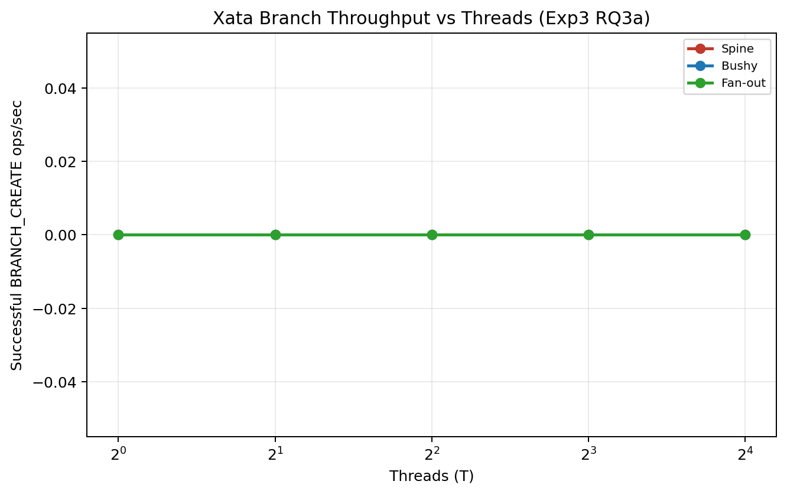
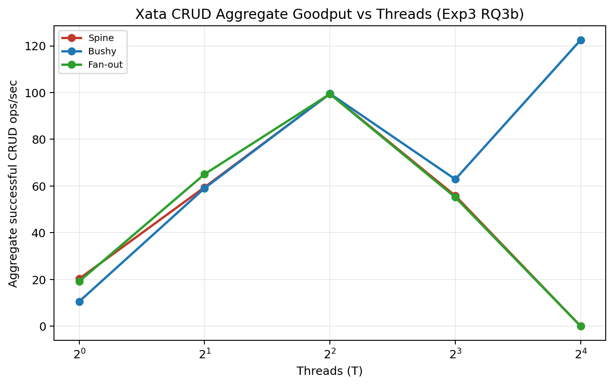
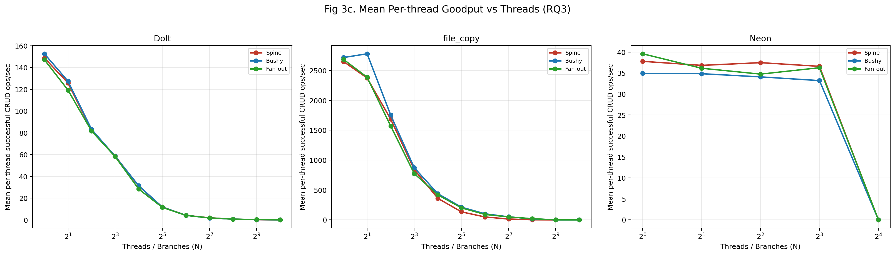
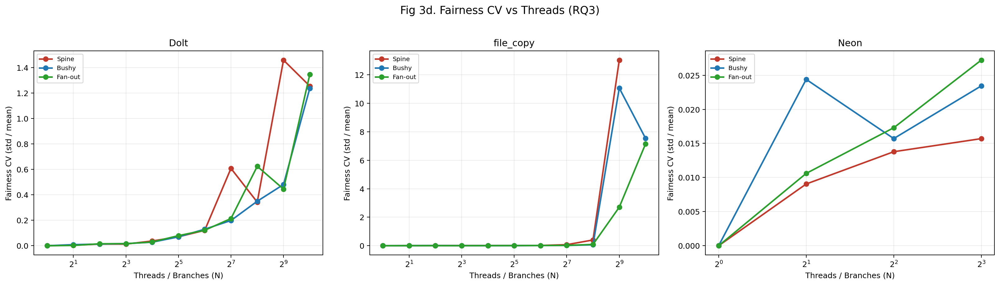
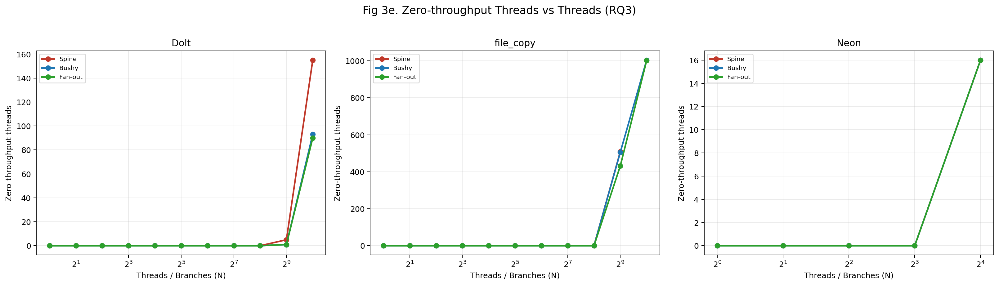
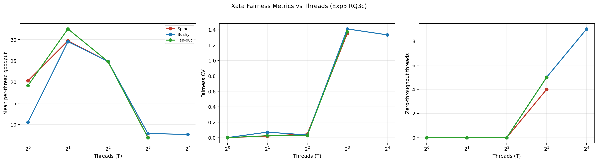
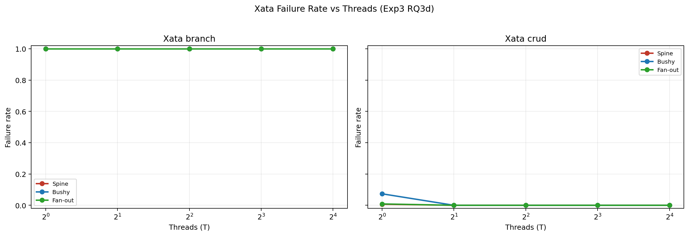

# Experiment 3: Throughput Under Branching

**Date**: 2026-02-20 to 2026-02-25 (Dolt, file_copy, Neon, Xata)

## 0. Summary

| Backend | Measurement type | Key finding | Max T measured |
| --- | --- | --- | --- |
| `dolt` | Throughput/failure from operation rows in throughput parquet | Branch-create throughput peaks at `79.03 ops/s (bushy, T=4)` and declines to `2.47-3.50 ops/s` at `T=1024`; CRUD remains non-zero at `T=1024` (`122.77-152.67 ops/s`) | 1024 |
| `file_copy` | Same | Branch-create throughput collapses to `0.00` from `T>=2`; CRUD is high at low/mid T but near-zero at `T=1024` (`60.60-73.37 ops/s`, one missing point) | 1024 |
| `neon` | Same | Branch-create throughput is `0.00` at all measured threads; CRUD rises to `~266-293 ops/s` at `T=8` then drops to `0.00` at `T=16` | 16 |
| `xata` | Consolidated Exp3 RQ parquet (`exp3_rq3a..d`) with quality flags | Branch-create throughput is `0.00` at all measured points; CRUD is topology-split (`bushy` reaches `122.53 ops/s` at `T=16`, `spine`/`fan_out` missing main CRUD parquet at `T=16`) | 16 |

## 1. Experiment Procedure

Each run point is backend × topology × mode × thread-count (`T`) with a 30s benchmark window.

### Configurations

| Parameter | Value |
| --- | --- |
| Backends | `dolt`, `file_copy`, `neon`, `xata` |
| Topologies | `spine`, `bushy`, `fan_out` |
| Modes | `branch` (branch creation), `crud` (READ/UPDATE/RANGE_READ/RANGE_UPDATE mix) |
| Threads (Dolt, file_copy) | `1,2,4,8,16,32,64,128,256,512,1024` |
| Threads (Neon, Xata) | `1,2,4,8,16` |
| Duration per point | `30s` |

### Data sources used in this report

| Backend scope | Source files |
| --- | --- |
| Dolt, file_copy, Neon | `/Users/garfield/PycharmProjects/db-fork/experiments/experiment-3-throughput/results/data/exp3_<backend>_<topology>_<T>t_<mode>_tpcc.parquet` |
| Xata | `/Users/garfield/PycharmProjects/db-fork/experiments/xata_consolidated/20260226_114337/rq/exp3_rq3a_branch_throughput.parquet`, `/Users/garfield/PycharmProjects/db-fork/experiments/xata_consolidated/20260226_114337/rq/exp3_rq3b_crud_aggregate_goodput.parquet`, `/Users/garfield/PycharmProjects/db-fork/experiments/xata_consolidated/20260226_114337/rq/exp3_rq3c_per_thread_fairness.parquet`, `/Users/garfield/PycharmProjects/db-fork/experiments/xata_consolidated/20260226_114337/rq/exp3_rq3d_failure_composition.parquet` |

## 2. Metrics

Branch-create throughput (`RQ3a`):

```text
branch_create_throughput = successful rows with op_type == BRANCH_CREATE / 30
```

CRUD aggregate goodput (`RQ3b`):

```text
crud_aggregate_goodput = successful CRUD rows / 30
```

Per-thread fairness (`RQ3c`):

```text
per_thread_goodput_i = successful CRUD rows for thread i / 30
mean_per_thread_goodput = mean(per_thread_goodput_i over configured threads)
fairness_cv = std(per_thread_goodput_i, ddof=0) / mean_per_thread_goodput
zero_throughput_threads = count(per_thread_goodput_i == 0)
```

Failure metrics (`RQ3d`):

```text
failure_rate_ops = failed_ops / attempted_ops
failed_ops = attempted_ops - successful_ops
```

## 3. Research Questions

### 3.1 RQ-to-Evidence Mapping

| RQ | Evidence | Answer style |
| --- | --- | --- |
| `RQ3a` Branch-create throughput vs threads | Table 3.2 + Table 4.2 | Direct numeric trend |
| `RQ3b` CRUD aggregate goodput vs threads | Table 3.3 + Table 4.3 + Figure 4.7.2/4.7.3 | Direct numeric trend |
| `RQ3c` Per-thread fairness at scale | Table 3.4 + Table 4.5 + Figure 4.7.4/4.7.5/4.7.6/4.7.7 | Direct numeric trend |
| `RQ3d` Failure rate and composition | Table 3.5 + Table 4.6 + Figure 4.7.8 | Direct numeric trend |

### 3.2 RQ3a — Branch-create throughput vs threads

| Backend | T1 branch-create throughput (min-max over topology) | Peak branch-create throughput | Max-thread branch-create throughput (min-max over topology) | Answer |
| --- | --- | --- | --- | --- |
| `dolt` | `58.07-60.27` | `79.03` (`bushy`, `T=4`) | `2.47-3.50` at `T=1024` | Degrades strongly at high threads, but remains non-zero. |
| `file_copy` | `23.53-24.73` | `24.73` (`bushy`, `T=1`) | `0.00-0.00` at `T=1024` | Collapses under concurrency. |
| `neon` | `0.00-0.00` | `0.00` | `0.00-0.00` at `T=16` | No successful branch-create throughput in this dataset. |
| `xata` | `0.00-0.00` | `0.00` | `0.00-0.00` at `T=16` | No successful branch-create throughput in this dataset. |

**Answer**: throughput degrades with concurrency for measured branch creation. Behavior is backend-dependent, with complete collapse for `file_copy`, `neon`, and `xata` in this run set.

### 3.3 RQ3b — CRUD aggregate goodput vs threads

| Backend | T1 CRUD goodput (min-max over topology) | Peak CRUD goodput | Max-thread CRUD goodput (min-max over topology) | Answer |
| --- | --- | --- | --- | --- |
| `dolt` | `147.13-152.57` | `503.67` (`bushy`, `T=16`) | `122.77-152.67` at `T=1024` | Degradation from peak, but throughput remains non-zero at max T. |
| `file_copy` | `2650.40-2717.30` | `7021.33` (`bushy`, `T=4`) | `60.60-73.37` at `T=1024` (`spine` missing) | Strong high-T collapse from peak. |
| `neon` | `34.93-39.60` | `292.83` (`spine`, `T=8`) | `0.00-0.00` at `T=16` | Throughput drops to zero at max T. |
| `xata` | `10.53-20.30` | `122.53` (`bushy`, `T=16`) | `0.00-122.53` at `T=16` | Topology-split: `bushy` succeeds, `spine`/`fan_out` missing main parquet at `T=16`. |

**Answer**: CRUD goodput does not scale linearly with threads. At high T, degradation or collapse appears for most backend/topology combinations.

### 3.4 RQ3c — Per-thread fairness

| Backend | Tmax | Mean per-thread goodput range | CV range | Zero-throughput thread range | Answer |
| --- | --- | --- | --- | --- | --- |
| `dolt` | 1024 | `0.120-0.149` | `1.236-1.345` | `90-155` | Fairness degrades at scale, but not catastrophic starvation. |
| `file_copy` | 1024 | `0.059-0.072` (`spine` missing) | `7.145-7.538` | `1002-1004` | Severe starvation/high skew at max T. |
| `neon` | 16 | `0.000-0.000` | `0.000-0.000` by implementation | `16-16` | All threads are zero-throughput at max T. |
| `xata` | 16 | bushy=`7.658`; spine/fan_out=`NA` | bushy=`1.333`; others=`NA` | bushy=`9`; others=`NA` | Only bushy has measurable fairness at Tmax in current artifacts. |

**Answer**: fairness is strongly backend/topology dependent at high concurrency, with extreme skew for `file_copy` and partial observability for `xata`.

### 3.5 RQ3d — Failure rate and composition

| Backend | Mode | Attempted ops | Failed ops | Failure rate | Top failure category |
| --- | --- | ---: | ---: | ---: | --- |
| `dolt` | `branch` | 156,604 | 42,757 | 27.30% | `FAILURE_TIMEOUT (42,757)` |
| `dolt` | `crud` | 375,847 | 96,994 | 25.81% | `FAILURE_TIMEOUT (95,260)` |
| `file_copy` | `branch` | 13,380 | 8,995 | 67.23% | `FAILURE_BACKEND_STATE_CONFLICT (8,960)` |
| `file_copy` | `crud` | 4,239,600 | 26,261 | 0.62% | `FAILURE_TIMEOUT (26,261)` |
| `neon` | `branch` | 2,248 | 2,248 | 100.00% | `FAILURE_BACKEND_STATE_CONFLICT (1,978)` |
| `neon` | `crud` | 48,081 | 21 | 0.04% | `FAILURE_TIMEOUT (18)` |
| `xata` | `branch` | 200 | 200 | 100.00% | `FAILURE_TIMEOUT (200)` |
| `xata` | `crud` | 24,887 | 34 | 0.14% | `FAILURE_TIMEOUT (34)` |

**Answer**: failure behavior diverges sharply by backend and mode. Branch mode is the dominant failure surface for `file_copy`, `neon`, and `xata` in this dataset.

## 4. Results

### 4.1 Matrix coverage

| Backend | Expected points | Found/represented points | Missing points |
| --- | ---: | ---: | ---: |
| `dolt` | 66 | 66 | 0 |
| `file_copy` | 66 | 65 | 1 |
| `neon` | 30 | 30 | 0 |
| `xata` | 30 | 30 | 0 |

Coverage notes:
- Missing non-Xata point: `file_copy`, `spine`, `crud`, `T=1024`.
- Xata quality flags from consolidated outputs: `28/30` points have main parquet, `20/30` are marked partial-by-summary.

### 4.2 Branch throughput detailed (backend × topology)

| Backend | Topology | T1 branch-create throughput (ops/s) | Peak branch-create throughput | Max-thread branch-create throughput | Max/T1 |
| --- | --- | ---: | --- | --- | ---: |
| `dolt` | `spine` | 58.07 | 77.10 (T=4) | 2.47 (T=1024) | 0.042 |
| `dolt` | `bushy` | 59.37 | 79.03 (T=4) | 3.50 (T=1024) | 0.059 |
| `dolt` | `fan_out` | 60.27 | 78.47 (T=4) | 2.73 (T=1024) | 0.045 |
| `file_copy` | `spine` | 24.23 | 24.23 (T=1) | 0.00 (T=1024) | 0.000 |
| `file_copy` | `bushy` | 24.73 | 24.73 (T=1) | 0.00 (T=1024) | 0.000 |
| `file_copy` | `fan_out` | 23.53 | 23.53 (T=1) | 0.00 (T=1024) | 0.000 |
| `neon` | `spine` | 0.00 | 0.00 (T=1) | 0.00 (T=16) | NA |
| `neon` | `bushy` | 0.00 | 0.00 (T=1) | 0.00 (T=16) | NA |
| `neon` | `fan_out` | 0.00 | 0.00 (T=1) | 0.00 (T=16) | NA |
| `xata` | `spine` | 0.00 | 0.00 (T=1) | 0.00 (T=16) | NA |
| `xata` | `bushy` | 0.00 | 0.00 (T=1) | 0.00 (T=16) | NA |
| `xata` | `fan_out` | 0.00 | 0.00 (T=1) | 0.00 (T=16) | NA |

### 4.3 CRUD aggregate throughput detailed (backend × topology)

| Backend | Topology | T1 aggregate CRUD throughput (ops/s) | Peak aggregate throughput | Max-thread aggregate throughput | Max/T1 |
| --- | --- | ---: | --- | --- | ---: |
| `dolt` | `spine` | 148.77 | 498.10 (T=16) | 122.77 (T=1024) | 0.825 |
| `dolt` | `bushy` | 152.57 | 503.67 (T=16) | 151.17 (T=1024) | 0.991 |
| `dolt` | `fan_out` | 147.13 | 465.63 (T=8) | 152.67 (T=1024) | 1.038 |
| `file_copy` | `spine` | 2650.40 | 6745.10 (T=4) | NA (T=1024) | NA |
| `file_copy` | `bushy` | 2717.30 | 7021.33 (T=4) | 73.37 (T=1024) | 0.027 |
| `file_copy` | `fan_out` | 2686.47 | 6706.90 (T=16) | 60.60 (T=1024) | 0.023 |
| `neon` | `spine` | 37.80 | 292.83 (T=8) | 0.00 (T=16) | 0.000 |
| `neon` | `bushy` | 34.93 | 265.67 (T=8) | 0.00 (T=16) | 0.000 |
| `neon` | `fan_out` | 39.60 | 290.20 (T=8) | 0.00 (T=16) | 0.000 |
| `xata` | `spine` | 20.30 | 99.47 (T=4) | 0.00 (T=16) | 0.000 |
| `xata` | `bushy` | 10.53 | 122.53 (T=16) | 122.53 (T=16) | 11.633 |
| `xata` | `fan_out` | 19.17 | 99.40 (T=4) | 0.00 (T=16) | 0.000 |

### 4.4 Per-thread degradation (T1 → Tmax)

| Backend | Topology | T1 per-thread goodput (ops/s/thread) | Max-thread per-thread goodput | Per-thread degradation T1→Tmax | Zero-throughput threads at Tmax |
| --- | --- | ---: | ---: | ---: | ---: |
| `dolt` | `spine` | 148.77 | 0.12 | 99.92% | 155 |
| `dolt` | `bushy` | 152.57 | 0.15 | 99.90% | 93 |
| `dolt` | `fan_out` | 147.13 | 0.15 | 99.90% | 90 |
| `file_copy` | `spine` | 2650.40 | NA | NA | NA |
| `file_copy` | `bushy` | 2717.30 | 0.07 | 100.00% | 1004 |
| `file_copy` | `fan_out` | 2686.47 | 0.06 | 100.00% | 1002 |
| `neon` | `spine` | 37.80 | 0.00 | 100.00% | 16 |
| `neon` | `bushy` | 34.93 | 0.00 | 100.00% | 16 |
| `neon` | `fan_out` | 39.60 | 0.00 | 100.00% | 16 |
| `xata` | `spine` | 20.30 | NA | NA | NA |
| `xata` | `bushy` | 10.53 | 7.66 | 27.29% | 9 |
| `xata` | `fan_out` | 19.17 | NA | NA | NA |

### 4.5 Fairness metrics at max thread count

| Backend | Topology | Tmax | Mean per-thread goodput (ops/s/thread) | CV at Tmax | Zero-throughput threads |
| --- | --- | ---: | ---: | ---: | ---: |
| `dolt` | `spine` | 1024 | 0.120 | 1.255 | 155 |
| `dolt` | `bushy` | 1024 | 0.148 | 1.236 | 93 |
| `dolt` | `fan_out` | 1024 | 0.149 | 1.345 | 90 |
| `file_copy` | `spine` | 1024 | NA | NA | NA |
| `file_copy` | `bushy` | 1024 | 0.072 | 7.538 | 1004 |
| `file_copy` | `fan_out` | 1024 | 0.059 | 7.145 | 1002 |
| `neon` | `spine` | 16 | 0.000 | 0.000 | 16 |
| `neon` | `bushy` | 16 | 0.000 | 0.000 | 16 |
| `neon` | `fan_out` | 16 | 0.000 | 0.000 | 16 |
| `xata` | `spine` | 16 | NA | NA | NA |
| `xata` | `bushy` | 16 | 7.658 | 1.333 | 9 |
| `xata` | `fan_out` | 16 | NA | NA | NA |

### 4.6 Failure summary by backend and mode

| Backend | Mode | Attempted ops | Successful ops | Failed ops | Failed exception ops | Failed slow ops | Failure rate | Top failure category |
| --- | --- | ---: | ---: | ---: | ---: | ---: | ---: | --- |
| `dolt` | `branch` | 156,604 | 113,847 | 42,757 | 0 | 42,757 | 27.30% | `FAILURE_TIMEOUT (42,757)` |
| `dolt` | `crud` | 375,847 | 278,853 | 96,994 | 1,734 | 95,260 | 25.81% | `FAILURE_TIMEOUT (95,260)` |
| `file_copy` | `branch` | 13,380 | 4,385 | 8,995 | 8,960 | 35 | 67.23% | `FAILURE_BACKEND_STATE_CONFLICT (8,960)` |
| `file_copy` | `crud` | 4,239,600 | 4,213,339 | 26,261 | 0 | 26,261 | 0.62% | `FAILURE_TIMEOUT (26,261)` |
| `neon` | `branch` | 2,248 | 0 | 2,248 | 1,978 | 270 | 100.00% | `FAILURE_BACKEND_STATE_CONFLICT (1,978)` |
| `neon` | `crud` | 48,081 | 48,060 | 21 | 3 | 18 | 0.04% | `FAILURE_TIMEOUT (18)` |
| `xata` | `branch` | 200 | 0 | 200 | 22 | 178 | 100.00% | `FAILURE_TIMEOUT (200)` |
| `xata` | `crud` | 24,887 | 24,853 | 34 | 0 | 34 | 0.14% | `FAILURE_TIMEOUT (34)` |

### 4.7 Figures and direct observations

#### 4.7.1 Xata branch throughput



Observed: all plotted Xata branch points are at `0.00 ops/s`.

#### 4.7.2 Non-Xata CRUD aggregate goodput


Observed: Dolt and file_copy rise then decline; Neon drops to zero at `T=16`.

#### 4.7.3 Xata CRUD aggregate goodput



Observed: bushy rises to `122.53 ops/s` at `T=16`; spine and fan_out are zero at `T=16` in consolidated outputs.

#### 4.7.4 Non-Xata mean per-thread goodput



Observed: high-thread per-thread throughput collapses for all non-Xata backends.

#### 4.7.5 Non-Xata fairness CV



Observed: CV increases sharply for file_copy at high T.

#### 4.7.6 Non-Xata zero-throughput threads



Observed: file_copy reaches `1000+` zero-throughput threads at `T=1024`.

#### 4.7.7 Xata fairness metrics



Observed: only bushy has measurable fairness at `T=16` because spine/fan_out lack main CRUD parquet at `T=16`.

#### 4.7.8 Xata failure rate



Observed: Xata branch failure rate is 100%; CRUD failure rate remains low.

## 5. Notable Observations

- `file_copy` has one missing matrix point: `spine/T=1024/crud` main parquet absent.
- Xata has full represented point coverage (`30/30`) but only `28/30` points with main parquet and `20/30` points marked partial-by-summary.
- Branch-mode outcomes differ sharply from CRUD-mode outcomes for `neon` and `xata`.
- `fairness_cv` is reported as `0.000` for Neon at `T=16` by current implementation because mean per-thread goodput is zero; interpret this as degenerate/all-zero throughput.
- These artifacts were collected with the older outcome policy (`threshold_latency_seconds=0.1` in recorded rows), not the newer 10-minute threshold configuration.

## 6. Hypotheses for Analysis

[//]: # ()
[//]: # (### 6.1 Branch-mode collapse surfaces)

[//]: # ()
[//]: # (**Observed**:)

[//]: # (- `file_copy` branch-create throughput is `0.00` from `T>=2`.)

[//]: # (- `neon` and `xata` branch-create throughput are `0.00` across measured T.)

[//]: # ()
[//]: # (**Hypothesis**:)

[//]: # (- These patterns are consistent with branch-creation control-plane contention/limits being the dominant bottleneck under this run configuration.)

[//]: # ()
[//]: # (### 6.2 CRUD resilience differs from branch creation)

[//]: # ()
[//]: # (**Observed**:)

[//]: # (- `file_copy` and `xata` can still produce non-trivial CRUD goodput where branch throughput is zero.)

[//]: # (- `xata` bushy reaches `122.53 ops/s` at `T=16`, while xata branch remains `0.00`.)

[//]: # ()
[//]: # (**Hypothesis**:)

[//]: # (- CRUD data-plane execution is less constrained than branch-management paths in this dataset.)

[//]: # ()
[//]: # (### 6.3 High-thread fairness collapse)

[//]: # ()
[//]: # (**Observed**:)

[//]: # (- At max T, file_copy has `1002-1004` zero-throughput threads and CV `~7.1-7.5`.)

[//]: # (- Dolt has non-zero throughput with lower CV &#40;`~1.24-1.35`&#41; and fewer zero threads &#40;`90-155`&#41;.)

[//]: # ()
[//]: # (**Hypothesis**:)

[//]: # (- Backend scheduling and lock/contention behavior produce very different starvation profiles at extreme concurrency.)

[//]: # ()
[//]: # (### 6.4 Xata partial-point caveat)

[//]: # ()
[//]: # (**Observed**:)

[//]: # (- Xata spine/fan_out `T=16` CRUD points are represented via summary/manifest with missing main parquet.)

[//]: # ()
[//]: # (**Hypothesis**:)

[//]: # (- Any topology comparison at Xata `T=16` is under-constrained and should be treated as provisional until complete main parquet coverage exists.)

## 7. Traceability references

- Non-Xata table computations: `/Users/garfield/PycharmProjects/db-fork/experiments/experiment-3-throughput/results/scripts/04_generate_report_tables.py` (with manifest override to avoid stale local xata-only manifest).
- Xata table computations: `/Users/garfield/PycharmProjects/db-fork/experiments/experiment-3-throughput/results/scripts/06_generate_xata_report_assets.py` using consolidated RQ parquet.
- Raw non-Xata run files: `/Users/garfield/PycharmProjects/db-fork/experiments/experiment-3-throughput/results/data`.
- Consolidated Xata files: `/Users/garfield/PycharmProjects/db-fork/experiments/xata_consolidated/20260226_114337/rq`.
