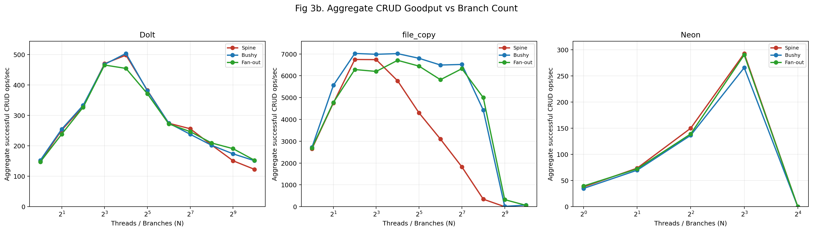

# Experiment 3: Operation Throughput Under Branching

**Date**: 2026-02-20 (Dolt, file_copy), 2026-02-21 (Neon), 2026-02-22 (extended matrix)

## 0. Summary Table

| RQ | Summary |
|----|---------|
| RQ1. Branch-Creation Throughput vs Concurrency | - Hypothesis: branch throughput should degrade after concurrency saturation.<br>- Observed: Dolt peaks then declines; file_copy collapses from `T>=2`; Neon is zero at `T=16`.<br>- Reason: file_copy hits PostgreSQL template-backend conflicts; Neon hits branch quota (`BRANCHES_LIMIT_EXCEEDED`). |
| RQ2. CRUD Throughput vs Branch Count | - Hypothesis: per-branch CRUD performance should degrade as `T` (and branch count) grows.<br>- Observed: strong per-thread degradation at high `T`; file_copy `spine/T=1024` timed out.<br>- Reason: high-concurrency contention plus timeout policy (`FAILURE_TIMEOUT` at `>0.1s`) and long setup/execute paths. |
| RQ3. Topology and Fairness | - Hypothesis: topology should influence throughput distribution under contention.<br>- Observed: Dolt and file_copy show topology-sensitive skew/starvation at high `T`.<br>- Reason: branch-depth/parent-selection effects and backend contention amplify unfairness at scale. |

### Measured Metrics (RQ1-RQ3 Only)

| RQ | Primary metric | Definition used in this report |
|----|----------------|--------------------------------|
| RQ1 | Branch-create throughput | `successful rows where op_type = BRANCH_CREATE / 30s` |
| RQ2 | CRUD aggregate throughput | `successful CRUD rows / 30s`, where CRUD rows are `READ`, `UPDATE`, `RANGE_READ`, `RANGE_UPDATE` |
| RQ3 | Fairness CV | `std(per-thread CRUD goodput) / mean(per-thread CRUD goodput)`, where `per-thread CRUD goodput = successful CRUD rows for a thread / 30s` |

## 1. Research Questions & Short Answers

**RQ1: Does branch creation throughput degrade with concurrent threads?**

**Yes.**
- Dolt branch creation peaks at low-to-mid thread counts, then declines at high thread counts.
- file_copy branch creation collapses under concurrency (zero successful branch ops from `T>=2`).
- Neon branch creation at `T=16` is quota-limited and yields zero throughput.

**RQ2: Does branch count degrade per-branch operation throughput?**

**Yes.**
- Exp3 CRUD setup enforces `1 thread = 1 branch` (`setup_branches = threads`).
- Per-thread CRUD goodput degrades sharply at high thread counts.
- At backend maximum thread counts, aggregate throughput often drops well below peak values.

**RQ3: Does topology affect throughput distribution/fairness?**

**Yes.**
- High-concurrency fairness differs by topology.
- Dolt and file_copy show topology-sensitive dispersion and starvation effects.

## 2. Methodology

- Backends: Dolt, file_copy, Neon.
- Topologies: spine, bushy, fan_out.
- Modes: branch creation (Exp3a), CRUD mix (Exp3b).
- Thread sets: Dolt/file_copy `1,2,4,8,16,32,64,128,256,512,1024`; Neon `1,2,4,8,16`.
- Measurement window: 30 seconds per run point.
- Matrix behavior: continue-on-failure; failures are recorded per operation and per run point.

Success/failure definitions:
- `success`: operation row with `result.outcome.success=true`.
- `FAILURE_TIMEOUT`: non-exception operation whose latency exceeds threshold.
- `exception failure`: operation raises error and is recorded with failure category/phase/reason.

Latency failure rule (`FAILURE_TIMEOUT`):
- baseline latency = `0.01s` (constant from prior Exp3 P95 analysis; raw one-time P95 was `0.010005447990261016`).
- slow multiplier = `10.0`.
- threshold = `0.1s`.
- if `observed_latency > 0.1s`, mark the op as unsuccessful timeout-labeled failure.

## 3. Results

### 3.1 RQ1: Branch-Creation Throughput vs Concurrency


*Figure 1. Branch creation throughput vs threads.*


**Interpretation**
- Dolt remains non-zero at `T=1024` but below its low-thread peak.
- file_copy throughput collapses to zero at high threads.
- Neon branch throughput is zero at `T=16` due to branch-limit failures.

**Why Dolt appears to rise again after `T=128`**
- The current RQ1 throughput series is computed from all successful rows in branch mode.
- In this implementation, each branch attempt records two timed ops:
  1. `BRANCH_CREATE`
  2. `BRANCH_CONNECT`
- At high `T`, `BRANCH_CREATE` degrades heavily (mostly timeout-labeled failures), but
  `BRANCH_CONNECT` remains near-100% successful and contributes many successful rows.
- Result: aggregate "branch-mode successful ops/sec" can rebound even while true
  branch-creation throughput keeps declining.

Concrete Dolt evidence from current parquet data (sum over 3 topologies):
- `T=128`: create success throughput `22.23 ops/s`, connect success throughput `232.93 ops/s`,
  aggregate successful branch-mode throughput `255.17 ops/s`.
- `T=1024`: create success throughput `8.70 ops/s`, connect success throughput `306.90 ops/s`,
  aggregate successful branch-mode throughput `315.60 ops/s`.

Implication:
- If the research question is strictly branch-creation capacity, use `op_type = BRANCH_CREATE`
  only for the RQ1 throughput metric.

**PostgreSQL C-level path for file_copy plunge (Q1)**

`file_copy` branching is `CREATE DATABASE ... TEMPLATE ... STRATEGY = FILE_COPY`.
The observed collapse is explained by PostgreSQL's internal lock/backends checks:

1. `createdb()` resolves the template DB under `ShareLock`.
- Source: [dbcommands.c#L947-L966](https://github.com/postgres/postgres/blob/REL_15_STABLE/src/backend/commands/dbcommands.c#L947-L966)
- Key call:
  ```c
  get_db_info(dbtemplate, ShareLock, ...)
  ```

2. Before copying, `createdb()` rejects templates that still have other backends.
- Source: [dbcommands.c#L1247-L1261](https://github.com/postgres/postgres/blob/REL_15_STABLE/src/backend/commands/dbcommands.c#L1247-L1261)
- Key check:
  ```c
  if (CountOtherDBBackends(src_dboid, ...))
      ereport(ERROR, ... "source database ... is being accessed by other users");
  ```

3. `CountOtherDBBackends()` is bounded-wait conflict detection, not unbounded queueing.
- Source: [procarray.c#L3726-L3812](https://github.com/postgres/postgres/blob/REL_15_STABLE/src/backend/storage/ipc/procarray.c#L3726-L3812)
- Behavior:
  - scans `ProcArray` for backends with matching `databaseId`;
  - excludes current backend;
  - retries 50 times with 100ms sleep (~5s total);
  - returns conflict if still present.

4. Why connected sessions conflict with cloning:
- Backend startup takes `RowExclusiveLock` on the database object:
  [postinit.c#L971-L1000](https://github.com/postgres/postgres/blob/REL_15_STABLE/src/backend/utils/init/postinit.c#L971-L1000)
- Lock matrix: `ShareLock` conflicts with `RowExclusiveLock`:
  [lock.c#L84-L88](https://github.com/postgres/postgres/blob/REL_15_STABLE/src/backend/storage/lmgr/lock.c#L84-L88)

Operational conclusion for RQ1:
- If many workers concurrently issue template clones from the same parent, active sessions
  on that source parent trigger repeated `OBJECT_IN_USE` failures after bounded waits.
- This is the direct C-level mechanism behind the observed file_copy branch-throughput collapse.

### Table 2. Branch Throughput Summary by Backend

| Backend | T1 branch throughput (ops/s, min-max over topology) | Peak branch throughput (ops/s) | Max-thread throughput (ops/s, min-max over topology) | Max-thread definition |
|---------|-----------------------------------------------------|--------------------------------|------------------------------------------------------|-----------------------|
| dolt | 116.13 - 120.53 | 159.10 (bushy, T=8) | 104.40 - 106.20 | T=1024 |
| file_copy | 47.53 - 49.83 | 49.83 (bushy, T=1) | 0.00 - 0.00 | T=1024 |
| neon | 0.00 - 0.00 | 0.00 (spine, T=1) | 0.00 - 0.00 | T=16 |

### Table 3. Branch Throughput Detailed (Backend x Topology)

| Backend | Topology | T1 throughput (ops/s) | Peak throughput | Max-thread throughput | Max/T1 |
|---------|----------|-----------------------|-----------------|-----------------------|--------|
| dolt | spine | 116.13 | 154.20 (T=4) | 105.00 (T=1024) | 0.904 |
| dolt | bushy | 118.73 | 159.10 (T=8) | 104.40 (T=1024) | 0.879 |
| dolt | fan_out | 120.53 | 156.93 (T=4) | 106.20 (T=1024) | 0.881 |
| file_copy | spine | 48.80 | 48.80 (T=1) | 0.00 (T=1024) | 0.000 |
| file_copy | bushy | 49.83 | 49.83 (T=1) | 0.00 (T=1024) | 0.000 |
| file_copy | fan_out | 47.53 | 47.53 (T=1) | 0.00 (T=1024) | 0.000 |
| neon | spine | 0.00 | 0.00 (T=1) | 0.00 (T=16) | NA |
| neon | bushy | 0.00 | 0.00 (T=1) | 0.00 (T=16) | NA |
| neon | fan_out | 0.00 | 0.00 (T=1) | 0.00 (T=16) | NA |

### 3.2 RQ2: CRUD Throughput and Per-Thread Degradation


*Figure 2. Aggregate successful CRUD throughput vs threads.*


- Dolt peaks at moderate threads, then degrades by `T=1024`.
- file_copy drops sharply at high threads; one `T=1024` point timed out entirely.
- Neon reaches usable throughput at lower threads but falls to zero at `T=16` in this dataset.

### Table 4. CRUD Aggregate Throughput Detailed (Backend x Topology)

| Backend | Topology | T1 aggregate CRUD throughput (ops/s) | Peak aggregate throughput | Max-thread aggregate throughput | Max/T1 |
|---------|----------|--------------------------------------|---------------------------|---------------------------------|--------|
| dolt | spine | 148.77 | 498.10 (T=16) | 122.77 (T=1024) | 0.825 |
| dolt | bushy | 152.57 | 503.67 (T=16) | 151.17 (T=1024) | 0.991 |
| dolt | fan_out | 147.13 | 465.63 (T=8) | 152.67 (T=1024) | 1.038 |
| file_copy | spine | 2650.40 | 6745.10 (T=4) | NA (T=1024) | NA |
| file_copy | bushy | 2717.30 | 7021.33 (T=4) | 73.37 (T=1024) | 0.027 |
| file_copy | fan_out | 2686.47 | 6706.90 (T=16) | 60.60 (T=1024) | 0.023 |
| neon | spine | 37.80 | 292.83 (T=8) | 0.00 (T=16) | 0.000 |
| neon | bushy | 34.93 | 265.67 (T=8) | 0.00 (T=16) | 0.000 |
| neon | fan_out | 39.60 | 290.20 (T=8) | 0.00 (T=16) | 0.000 |

### Table 5. CRUD Per-thread Degradation (T1 -> Tmax)

| Backend | Topology | T1 per-thread goodput (ops/s/thread) | Max-thread per-thread goodput | Per-thread degradation T1->Tmax | Zero-throughput threads at Tmax |
|---------|----------|--------------------------------------|-------------------------------|---------------------------------|---------------------------------|
| dolt | spine | 148.77 | 0.12 | 99.92% | 155 |
| dolt | bushy | 152.57 | 0.15 | 99.90% | 93 |
| dolt | fan_out | 147.13 | 0.15 | 99.90% | 90 |
| file_copy | spine | 2650.40 | NA | NA | NA |
| file_copy | bushy | 2717.30 | 0.07 | 100.00% | 1004 |
| file_copy | fan_out | 2686.47 | 0.06 | 100.00% | 1002 |
| neon | spine | 37.80 | 0.00 | 100.00% | 16 |
| neon | bushy | 34.93 | 0.00 | 100.00% | 16 |
| neon | fan_out | 39.60 | 0.00 | 100.00% | 16 |

### 3.3 RQ3: Topology and Fairness


*Figure 3. Per-thread CRUD throughput distribution at backend Tmax.*


*Figure 4. Spine topology per-thread throughput profile at highest available T.*


- Dolt shows topology-sensitive skew at `T=1024`.
- file_copy at `T=1024` is starvation-heavy (over 1000 zero-throughput threads in bushy/fan_out).
- Neon at `T=16` is uniformly starved (all zero-throughput threads in this run set).

### Table 6. Fairness at Max Thread Count (CRUD)

| Backend | Topology | Tmax | Mean per-thread goodput (ops/s/thread) | CV at Tmax | Zero-throughput threads |
|---------|----------|------|----------------------------------------|------------|-------------------------|
| dolt | spine | 1024 | 0.120 | 1.255 | 155 |
| dolt | bushy | 1024 | 0.148 | 1.236 | 93 |
| dolt | fan_out | 1024 | 0.149 | 1.345 | 90 |
| file_copy | spine | 1024 | NA | NA | NA |
| file_copy | bushy | 1024 | 0.072 | 7.538 | 1004 |
| file_copy | fan_out | 1024 | 0.059 | 7.145 | 1002 |
| neon | spine | 16 | 0.000 | 0.000 | 16 |
| neon | bushy | 16 | 0.000 | 0.000 | 16 |
| neon | fan_out | 16 | 0.000 | 0.000 | 16 |

### 3.4 Failure Behavior and Coverage


*Figure 5. Failure rate vs threads by backend/topology/mode.*


*Figure 6. Failure-category composition at backend Tmax.*


- Dolt failures are dominated by slow/timeout-labeled operations at high thread counts.
- file_copy failures are mixed: timeout-dominated in high-thread CRUD and backend-state conflicts in branch mode.
- Neon failures are dominated by backend-state conflicts (branch limits) with additional timeout-labeled slow ops.

### Table 1. Matrix Coverage

| Backend | Expected points | Found points | Missing points |
|---------|-----------------|--------------|----------------|
| dolt | 66 | 66 | 0 |
| file_copy | 66 | 65 | 1 |
| neon | 30 | 30 | 0 |
| TOTAL | 162 | 161 | 1 |

### Table 7. Failure Summary by Backend

| Backend | Attempted ops | Successful ops | Failed ops | Failed exception ops | Failed slow ops | Success rate | Top failure category |
|---------|---------------|----------------|------------|----------------------|-----------------|--------------|----------------------|
| dolt | 532,451 | 392,700 | 139,751 | 1,734 | 138,017 | 73.75% | FAILURE_TIMEOUT (138017) |
| file_copy | 4,252,980 | 4,217,724 | 35,256 | 8,960 | 26,296 | 99.17% | FAILURE_TIMEOUT (26296) |
| neon | 50,329 | 48,060 | 2,269 | 1,981 | 288 | 95.49% | FAILURE_BACKEND_STATE_CONFLICT (1981) |

## 4. Conclusion

The extended Exp3 matrix confirms that high concurrency can degrade throughput and increase failures across backends.

- Dolt: non-zero throughput at very high thread counts, but strong degradation and timeout-heavy failure profile.
- file_copy: severe branch-mode collapse under concurrent branch creation; CRUD throughput also collapses at high `T` with starvation and timeout behavior.
- Neon: branch/quota constraints dominate high-thread behavior in this run, limiting meaningful throughput at `T=16`.

The experiment framework successfully records partial failures and explicit reasons instead of aborting on first failure, making failure analysis reproducible and auditable.
