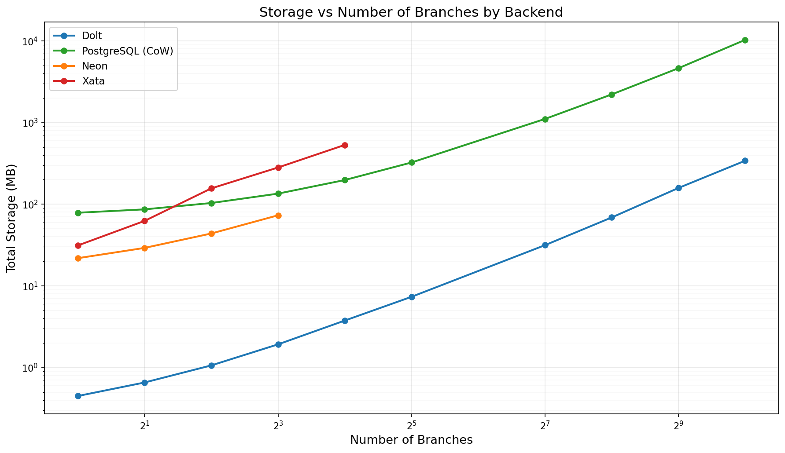
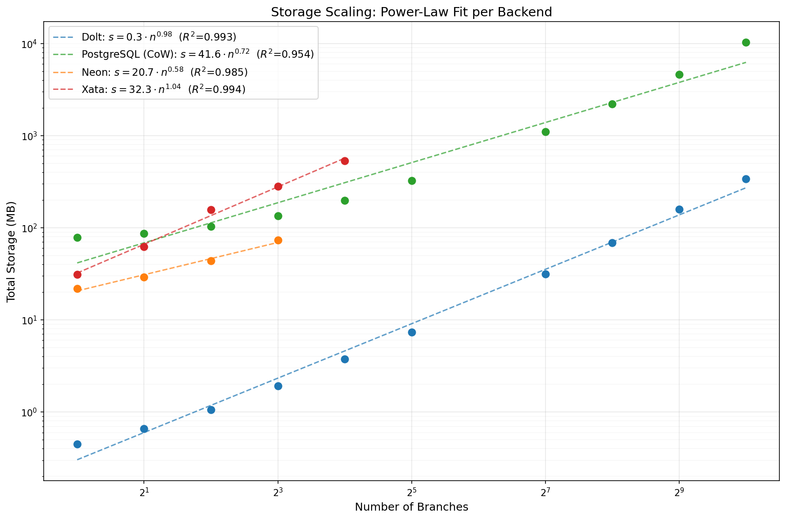
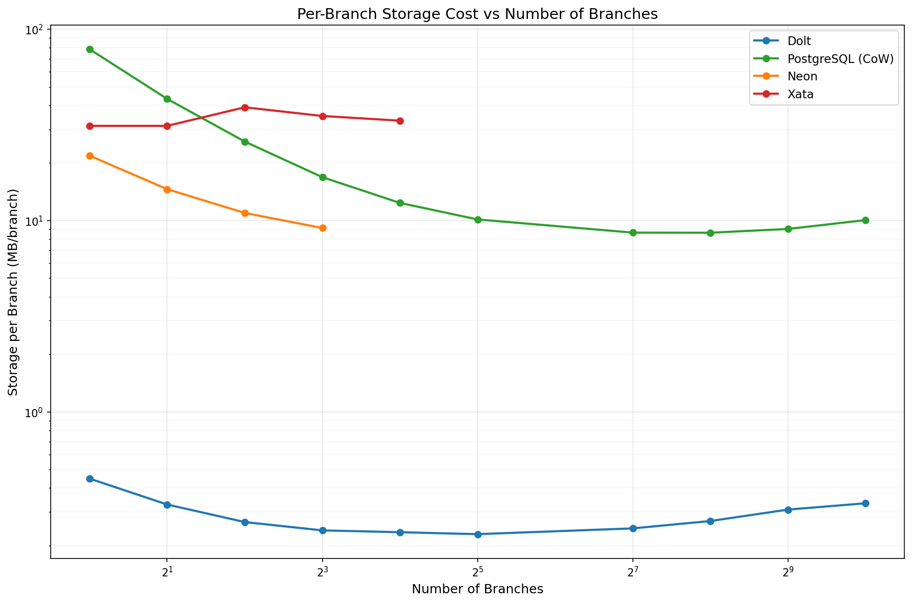
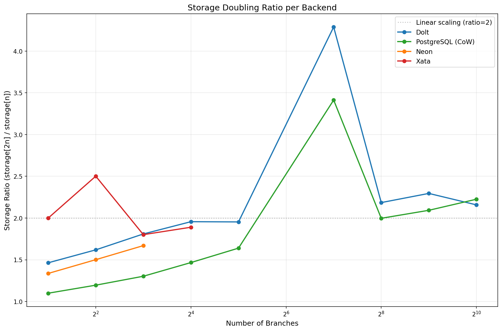

# Storage Scaling Analysis: Database Branching Backends

This report analyzes how storage grows as the number of database branches increases across four backends: **Dolt**, **PostgreSQL (CoW/APFS clone)**, **Neon**, and **Xata**. All experiments use a TPC-C `orders` table schema with the nth-op benchmark.

> All numerical results in this report were computed by
> [`reports/scripts/storage_analysis.py`](scripts/storage_analysis.py).

## 1. Experiment Overview

| Backend | Data Points | Branch Range | Total Rows |
|---|---|---|---|
| Dolt | 10 | 1 - 1024 | 180 |
| PostgreSQL (CoW) | 10 | 1 - 1024 | 350 |
| Neon | 4 | 1 - 8 | 90 |
| Xata | 5 | 1 - 16 | 66 |

Neon was limited to 8 branches by a plan-level `BRANCHES_LIMIT_EXCEEDED` cap. Xata data extends to 16 branches, but branches at higher counts hibernated due to scale-to-zero (`STATUS_TYPE_HIBERNATED`).

## 2. Absolute Storage Growth

| Branches | Dolt | PostgreSQL (CoW) | Neon | Xata |
|---|---|---|---|---|
| 1 | 458.91 KB | 78.69 MB | 21.84 MB | 31.27 MB |
| 2 | 671.90 KB | 86.55 MB | 29.20 MB | 62.53 MB |
| 4 | 1.06 MB | 103.52 MB | 43.84 MB | 156.42 MB |
| 8 | 1.92 MB | 134.89 MB | 73.20 MB | 281.75 MB |
| 16 | 3.76 MB | 197.88 MB | -- | 532.52 MB |
| 32 | 7.35 MB | 324.48 MB | -- | -- |
| 128 | 31.51 MB | 1.08 GB | -- | -- |
| 256 | 68.86 MB | 2.16 GB | -- | -- |
| 512 | 158.03 MB | 4.52 GB | -- | -- |
| 1024 | 341.01 MB | 10.06 GB | -- | -- |

At 1024 branches, PostgreSQL consumes **29.5x** more storage than Dolt (10.06 GB vs 341 MB).

## 3. Power-Law Scaling Analysis

We fit `storage(MB) = a * branches^b` via log-log linear regression to characterize the scaling behavior of each backend.

| Backend | a (MB) | b (exponent) | R^2 | Interpretation |
|---|---|---|---|---|
| Dolt | 0.30 | 0.981 | 0.9925 | ~linear |
| PostgreSQL (CoW) | 41.56 | 0.723 | 0.9539 | sublinear |
| Neon | 20.65 | 0.582 | 0.9850 | strongly sublinear |
| Xata | 32.29 | 1.035 | 0.9943 | ~linear |

**Key findings:**

- **Dolt (b = 0.98):** Nearly linear scaling with a tiny intercept (0.3 MB). Dolt's content-addressed Merkle tree means each branch stores only its diff from the parent. The per-branch overhead is ~1-7 KB of metadata, growing logarithmically with the total number of chunks.

- **PostgreSQL CoW (b = 0.72):** Sublinear because APFS clone (`file_copy_method=clone`) shares unchanged data pages via copy-on-write. However, the 41.56 MB intercept reflects the base PostgreSQL data directory overhead that exists regardless of branching. The R^2 of 0.954 (lowest) suggests the power-law model is a less perfect fit, likely due to the transition from CoW-dominated to linear-copy-dominated behavior at higher branch counts.

- **Neon (b = 0.58):** Most sublinear scaling. Neon's page server architecture means `pg_database_size()` only reports logical size -- physical storage is shared across branches at the storage layer. Note: only 4 data points (1-8 branches), so this fit should be interpreted cautiously.

- **Xata (b = 1.04):** Slightly superlinear. Each Xata branch is an independent Postgres instance with no storage sharing, so total storage scales 1:1 with the number of branches. The slight superlinearity (b > 1.0) may reflect per-branch overhead from system catalogs and WAL.

## 4. Per-Branch Storage Cost

This plot shows `total_storage / num_branches`, revealing how the average cost per branch changes at scale.

| Branches | Dolt | PostgreSQL (CoW) | Neon | Xata |
|---|---|---|---|---|
| 1 | 458.91 KB | 78.69 MB | 21.84 MB | 31.27 MB |
| 8 | 246.06 KB | 16.86 MB | 9.15 MB | 35.22 MB |
| 32 | 235.14 KB | 10.14 MB | -- | -- |
| 128 | 252.07 KB | 8.65 MB | -- | -- |
| 1024 | 341.01 KB | 10.06 MB | -- | -- |

- **Dolt** stabilizes around 235-340 KB/branch. The slight uptick at 512-1024 may be due to Merkle tree rebalancing.
- **PostgreSQL** drops sharply from 79 MB/branch (n=1, dominated by base directory overhead) to ~8.6 MB/branch (n=128), then slightly increases. The "U-shape" indicates an optimal range around 128-256 branches where overhead is best amortized.
- **Neon** follows the same pattern of decreasing per-branch cost (22 MB -> 9 MB), consistent with its shared page storage.
- **Xata** stays flat at ~31-39 MB/branch, confirming no storage sharing between branches.

## 5. Marginal Branch Cost (Per-Operation Delta)

The `disk_size_after - disk_size_before` for each BRANCH operation shows the actual bytes written per branch creation:

| Backend | Avg Delta per Branch | Notes |
|---|---|---|
| Dolt | 1.4 KB (n=1) to 7.3 KB (n=1024) | Only Merkle tree metadata; grows logarithmically |
| PostgreSQL (CoW) | ~7.79 MB (constant) | Exactly `initial_db_size`; each CoW clone adds one full logical copy |
| Neon | ~7.3 MB (constant) | Similar to Postgres -- `pg_database_size()` reflects logical size |
| Xata | 15-52 MB (variable) | High variance due to async branch provisioning; measures total project storage |

Dolt's marginal cost is **1000x smaller** than PostgreSQL's per branch creation (7 KB vs 7.8 MB).

## 6. Storage Amplification Factor

Amplification = `total_storage / (db_size * (num_branches + 1))`. Values < 1.0 indicate deduplication; > 1.0 indicates overhead.

| Branches | Dolt | PostgreSQL (CoW) | Neon | Xata |
|---|---|---|---|---|
| 1 | 0.500 | 5.053 | 1.486 | 1.955 |
| 8 | 0.477 | 1.925 | 1.106 | 3.914 |
| 32 | 0.497 | 1.263 | -- | -- |
| 128 | 0.545 | 1.103 | -- | -- |
| 1024 | 0.742 | 1.291 | -- | -- |

- **Dolt** consistently stays below 1.0 (0.47-0.74), meaning it deduplicates data across branches. Even at 1024 branches, total storage is only 74% of the "ideal" no-sharing case.
- **PostgreSQL** starts at 5x amplification (1 branch -- base directory includes shared WAL, config, etc.) and converges toward 1.0 as branches amortize overhead, then slightly rises again due to per-branch WAL accumulation.
- **Neon** converges to ~1.1 (slight overhead from page server metadata).
- **Xata** amplification is ~3.9x at 8+ branches, reflecting that each branch carries full Postgres overhead plus the Xata platform layer.

## 7. Branch Creation Latency

| Backend | Mean Latency | Trend |
|---|---|---|
| Dolt | 7.3 - 9.7 ms | Flat (O(1) branching via pointer copy) |
| PostgreSQL (CoW) | 34.5 - 77.5 ms | Slight increase at 256+ branches |
| Neon | 202 - 225 ms | Flat (API round-trip dominated) |
| Xata | 44,940 - 48,847 ms (~45s) | Flat (full instance provisioning) |

Dolt is **4-5x faster** than PostgreSQL and **25x faster** than Neon for branch creation. Xata is ~5000x slower due to full instance provisioning.

## 8. Storage Doubling Ratio

The ratio `storage(2n) / storage(n)` at each doubling step. A ratio of 2.0 means linear scaling.

| Backend | Range | Notable |
|---|---|---|
| Dolt | 1.46 - 4.29 | Spike at 32->128 (4.29x) due to jump in powers-of-2 sequence |
| PostgreSQL | 1.10 - 3.41 | Similarly spikes at 32->128; settles to ~2.0 at high N |
| Neon | 1.34 - 1.67 | Consistently sublinear |
| Xata | 1.80 - 2.50 | Spike at 2->4 (2.50x), otherwise near-linear |

The 32->128 spike for both Dolt and PostgreSQL is an artifact of the branch count sequence (1, 2, 4, 8, 16, 32, 128, ...) -- the jump skips 64, so the ratio covers a 4x increase in branches rather than 2x.

## 9. Projected Storage (Extrapolation)

Using the power-law fit to project storage at higher branch counts:

| Backend | 10 branches | 100 branches | 1,000 branches | 10,000 branches |
|---|---|---|---|---|
| Dolt | 2.90 MB | 27.77 MB | 265.70 MB | 2.48 GB |
| PostgreSQL (CoW) | 219.69 MB | 1.13 GB | 5.99 GB | 31.68 GB |
| Neon | 78.88 MB | 301.31 MB | 1.12 GB | 4.29 GB |
| Xata | 350.16 MB | 3.71 GB | 40.21 GB | 435.95 GB |

**Caution:** Neon and Xata projections are based on limited data (4-5 points) and should be treated as rough estimates. Neon's projection may underestimate due to its storage separation architecture. Xata's projection likely overestimates because hibernation effects are not modeled.

## 10. Summary

| Backend | Exponent (b) | Scaling | Cost @ max branches | Avg Branch Latency | Max Tested | R^2 |
|---|---|---|---|---|---|---|
| Dolt | 0.981 | ~linear | 0.3 MB/br (n=1024) | 8.0 ms | 1024 | 0.9925 |
| PostgreSQL (CoW) | 0.723 | sublinear | 10.1 MB/br (n=1024) | 48.0 ms | 1024 | 0.9539 |
| Neon | 0.582 | sublinear | 9.2 MB/br (n=8) | 212.2 ms | 8 | 0.9850 |
| Xata | 1.035 | ~linear | 33.3 MB/br (n=16) | 46581.9 ms | 16 | 0.9943 |

**Bottom line:** Dolt offers the best storage efficiency by a wide margin (~0.3 MB/branch at scale vs 10+ MB for others), with the fastest branch creation latency (8 ms). PostgreSQL CoW benefits from APFS deduplication but still carries substantial per-branch overhead. Neon shows the most sublinear scaling behavior thanks to its shared page storage, but was limited in testing scope. Xata's independent-instance model provides full isolation but at the highest storage and latency cost.
